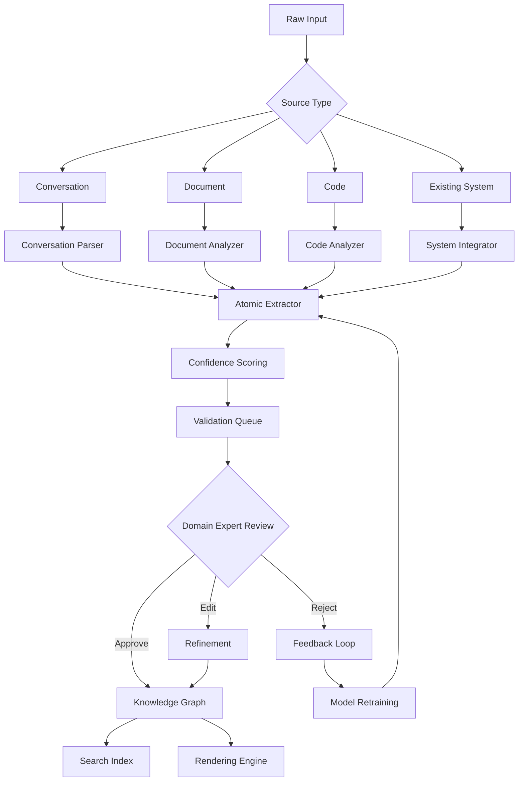

# Product-OS: Knowledge Extraction Pipeline

**Date**: 2026-01-11  
**Status**: Technical Reference Document  
**Version**: 1.0  
**Related**: [`product-os.md`](product-os.md) (Knowledge OS concept), [`product-os-data-structure.md`](product-os-data-structure.md) (Data structure concept), [`product-os-implementation-rendering.md`](product-os-implementation-rendering.md) (Standoff annotations), [`product-os-implementation-persistence.md`](product-os-implementation-persistence.md) (Polyglot database), [`product-os-implementation-search.md`](product-os-implementation-search.md) (Multi-level search), [`product-os-implementation-frontend.md`](product-os-implementation-frontend.md) (Frontend patterns)

---

## Overview

**Knowledge extraction pipeline** transforms unstructured conversations, documents, and code into structured atomic knowledge units (atoms, molecules, organisms). This document covers the AI-driven extraction, validation, and refinement workflow that populates the Knowledge OS graph.

**Key Principles**:
- **Multi-source ingestion**: Conversations, documents, code, existing systems
- **Confidence scoring**: AI-extracted knowledge with uncertainty quantification
- **Human-in-the-loop validation**: Domain expert review and refinement
- **Continuous learning**: Feedback loops improve extraction accuracy

---

## Pipeline Architecture

### End-to-End Extraction Flow


### Pipeline Components
```typescript
interface ExtractionPipeline {
  // Input adapters for different sources
  adapters: {
    conversation: ConversationAdapter;
    document: DocumentAdapter;
    code: CodeAdapter;
    api: APIAdapter;
  };
  
  // Extraction stages
  stages: {
    parsing: ParsingStage;
    extraction: ExtractionStage;
    validation: ValidationStage;
    refinement: RefinementStage;
    persistence: PersistenceStage;
  };
  
  // Quality control
  quality: {
    confidenceThreshold: number;
    validationRequired: boolean;
    autoApproveHighConfidence: boolean;
    expertRouting: ExpertRoutingService;
  };
}
```

---

## Input Sources & Adapters

### 1. Conversation Extraction
```typescript
// Extract knowledge from chat/conversation transcripts
class ConversationAdapter {
  async extractKnowledge(conversation: Conversation): Promise<ExtractionResult> {
    // Segment conversation into knowledge units
    const segments = await this.segmentConversation(conversation);
    
    // Extract atomic knowledge from each segment
    const extractions = await Promise.all(
      segments.map(segment => this.extractFromSegment(segment))
    );
    
    // Link related extractions across segments
    const linked = await this.linkRelatedExtractions(extractions);
    
    return {
      source: 'conversation',
      sourceId: conversation.id,
      extractions: linked,
      metadata: {
        participants: conversation.participants,
        timestamp: conversation.timestamp,
        context: conversation.context
      }
    };
  }
  
  private async extractFromSegment(segment: ConversationSegment) {
    // Use LLM to identify atomic knowledge
    const prompt = `
      Extract atomic knowledge units from this conversation segment:
      
      "${segment.text}"
      
      Identify:
      1. TextAtoms (facts, statements)
      2. NumberAtoms (quantities, percentages, rates)
      3. ConstraintMolecules (rules, restrictions)
      4. ConditionMolecules (if/then logic)
      5. ExceptionMolecules (special cases)
      
      Return as JSON matching the atomic schema.
    `;
    
    const llmResponse = await this.llm.complete(prompt);
    return this.parseLLMResponse(llmResponse);
  }
}
```

**Conversation Features**:
- **Speaker attribution**: Who said what (domain expert vs generalist)
- **Context preservation**: Conversation flow and dependencies
- **Uncertainty markers**: "I think", "probably", "approximately"
- **Question/answer pairs**: Extract knowledge from Q&A patterns

### 2. Document Analysis
```typescript
// Extract knowledge from documents (PDF, Word, Markdown, HTML)
class DocumentAdapter {
  async extractKnowledge(document: Document): Promise<ExtractionResult> {
    // Parse document structure
    const structure = await this.parseDocument(document);
    
    // Extract based on document type
    let extractions: AtomicExtraction[];
    
    switch (document.type) {
      case 'legal':
        extractions = await this.extractLegalDocument(structure);
        break;
      case 'technical':
        extractions = await this.extractTechnicalDocument(structure);
        break;
      case 'business':
        extractions = await this.extractBusinessDocument(structure);
        break;
      default:
        extractions = await this.extractGenericDocument(structure);
    }
    
    // Position extractions in document
    const positioned = await this.positionExtractions(extractions, structure);
    
    return {
      source: 'document',
      sourceId: document.id,
      extractions: positioned,
      metadata: {
        documentType: document.type,
        author: document.author,
        creationDate: document.creationDate,
        pageCount: structure.pageCount
      }
    };
  }
}
```

**Document Analysis Techniques**:
- **Layout analysis**: Headers, paragraphs, lists, tables
- **Semantic segmentation**: Introduction, body, conclusion, appendix
- **Citation extraction**: References to laws, regulations, standards
- **Change detection**: Track modifications across document versions

### 3. Code Analysis
```typescript
// Extract knowledge from source code
class CodeAdapter {
  async extractKnowledge(codebase: Codebase): Promise<ExtractionResult> {
    // Parse code to AST
    const ast = await this.parseCode(codebase);
    
    // Extract knowledge patterns
    const extractions = await Promise.all([
      this.extractBusinessLogic(ast),
      this.extractConstraints(ast),
      this.extractDomainModels(ast),
      this.extractConfiguration(ast)
    ]);
    
    // Flatten and deduplicate
    const flattened = extractions.flat();
    const unique = this.deduplicateExtractions(flattened);
    
    // Link to existing knowledge
    const linked = await this.linkToExistingKnowledge(unique);
    
    return {
      source: 'code',
      sourceId: codebase.id,
      extractions: linked,
      metadata: {
        language: codebase.language,
        project: codebase.project,
        commitHash: codebase.commitHash,
        fileCount: codebase.files.length
      }
    };
  }
  
  private async extractBusinessLogic(ast: AST) {
    // Find business rules in code
    const patterns = [
      'if (account.type === "corporate")',
      'taxRate = 0.15',
      'throw new ValidationError("must have consent")',
      'REQUIRES_PERMISSION("admin")'
    ];
    
    return this.matchPatterns(ast, patterns);
  }
}
```

**Code Analysis Patterns**:
- **Business rule extraction**: Constants, validation logic, conditional logic
- **API contract extraction**: Endpoints, request/response schemas
- **Data model extraction**: Entity relationships, constraints
- **Configuration extraction**: Feature flags, business parameters

### 4. Existing System Integration
```typescript
// Extract knowledge from existing systems (Jira, Confluence, Notion, etc.)
class SystemIntegrationAdapter {
  async extractKnowledge(system: ExternalSystem): Promise<ExtractionResult> {
    // Connect to external system
    const client = await this.connect(system);
    
    // Extract based on system type
    switch (system.type) {
      case 'jira':
        return await this.extractFromJira(client);
      case 'confluence':
        return await this.extractFromConfluence(client);
      case 'notion':
        return await this.extractFromNotion(client);
      case 'salesforce':
        return await this.extractFromSalesforce(client);
      default:
        throw new Error(`Unsupported system: ${system.type}`);
    }
  }
  
  private async extractFromJira(jiraClient: JiraClient) {
    // Extract knowledge from Jira issues
    const issues = await jiraClient.searchIssues('project = KOS');
    
    const extractions = await Promise.all(
      issues.map(async issue => {
        // Extract from issue fields
        const atoms = await this.extractAtomsFromIssue(issue);
        
        // Extract relationships from links
        const relationships = await this.extractRelationships(issue);
        
        return {
          atoms,
          relationships,
          sourceRef: `jira:${issue.key}`,
          confidence: this.calculateConfidence(issue)
        };
      })
    );
    
    return {
      source: 'jira',
      sourceId: 'project-kos',
      extractions,
      metadata: {
        project: 'KOS',
        issueCount: issues.length,
        extractionDate: new Date()
      }
    };
  }
}
```

**System Integration Points**:
- **Ticketing systems**: Requirements, acceptance criteria, business rules
- **Wiki/documentation**: Process documentation, guidelines, standards
- **CRM systems**: Customer requirements, business rules
- **Monitoring systems**: Operational constraints, performance requirements

---

## Atomic Extraction Engine

### Multi-Model Extraction Strategy
```typescript
class AtomicExtractor {
  private models = {
    // Rule-based extraction for known patterns
    ruleBased: RuleBasedExtractor,
    
    // LLM-based extraction for unstructured text
    llmBased: LLMExtractor,
    
    // ML-based extraction for specialized domains
    mlBased: MLExtractor,
    
    // Hybrid extraction combining multiple approaches
    hybrid: HybridExtractor
  };
  
  async extract(text: string, context: ExtractionContext): Promise<AtomicExtraction[]> {
    // Choose extraction strategy based on context
    const strategy = this.chooseStrategy(context);
    const extractor = this.models[strategy];
    
    // Perform extraction
    const extractions = await extractor.extract(text, context);
    
    // Post-process extractions
    const processed = await this.postProcess(extractions, context);
    
    // Calculate confidence scores
    const scored = await this.scoreConfidence(processed, context);
    
    return scored;
  }
  
  private chooseStrategy(context: ExtractionContext): ExtractionStrategy {
    if (context.domain === 'tax' && context.source === 'legal_document') {
      return 'ruleBased'; // Use specialized tax rule parser
    }
    
    if (context.confidenceThreshold > 0.9) {
      return 'hybrid'; // Use multiple models for high-confidence requirements
    }
    
    if (context.textLength > 1000) {
      return 'llmBased'; // LLM handles long-form text well
    }
    
    return 'mlBased'; // Default to machine learning
  }
}
```

### Extraction Templates
```yaml
# Domain-specific extraction templates
extraction_templates:
  tax_rule:
    description: "Extract tax rules from legal/regulatory text"
    
    atom_patterns:
      - type: NumberAtom
        patterns:
          - "\d+(\.\d+)?%"
          - "rate of \d+(\.\d+)?"
          - "\d+(\.\d+)? percent"
          
      - type: TextAtom  
        patterns:
          - "shall apply to"
          - "must be reported"
          - "subject to tax"
          
    molecule_patterns:
      - type: ConditionMolecule
        patterns:
          - "if .* then"
          - "when .* applies"
          - "in the case of"
          
      - type: ExceptionMolecule
        patterns:
          - "except for"
          - "excluding"
          - "not applicable to"
          
    validation_rules:
      - "NumberAtoms must have value between 0 and 1"
      - "ConditionMolecules must have both condition and consequence"
      - "ExceptionMolecules must specify what is excepted"
      
  business_requirement:
    description: "Extract business requirements from user stories"
    
    atom_patterns:
      - type: TextAtom
        patterns:
          - "As a .* I want"
          - "so that"
          - "must support"
          
      - type: ConstraintMolecule
        patterns:
          - "must not exceed"
          - "should be able to"
          - "requires approval"
```

### Confidence Scoring System
```typescript
class ConfidenceScorer {
  async scoreExtraction(extraction: AtomicExtraction): Promise<ScoredExtraction> {
    // Multi-factor confidence scoring
    const factors = {
      sourceQuality: await this.scoreSourceQuality(extraction.source),
      extractionMethod: this.scoreExtractionMethod(extraction.method),
      consistency: await this.checkConsistency(extraction),
      expertValidation: await this.getExpertValidationScore(extraction),
      crossValidation: await this.crossValidate(extraction)
    };
    
    // Weighted average
    const weights = {
      sourceQuality: 0.2,
      extractionMethod: 0.25,
      consistency: 0.2,
      expertValidation: 0.25,
      crossValidation: 0.1
    };
    
    const confidence = Object.entries(factors).reduce(
      (total, [factor, score]) => total + score * weights[factor],
      0
    );
    
    return {
      ...extraction,
      confidence,
      confidenceFactors: factors,
      requiresValidation: confidence < this.config.validationThreshold
    };
  }
  
  private async scoreSourceQuality(source: ExtractionSource): Promise<number> {
    // Score based on source reliability
    const sourceScores = {
      'legal_document': 0.9,
      'domain_expert_conversation': 0.85,
      'technical_documentation': 0.8,
      'code_analysis': 0.75,
      'user_conversation': 0.6,
      'ai_generated': 0.5
    };
    
    return sourceScores[source.type] || 0.5;
  }
}
```

---

## Validation Workflow

### Expert Review Queue
```typescript
class ValidationQueue {
  async routeForValidation(extraction: ScoredExtraction) {
    // Determine which experts should review
    const experts = await this.findQualifiedExperts(extraction);
    
    // Create validation task
    const task = await this.createValidationTask({
      extraction,
      assignedExperts: experts,
      priority: this.calculatePriority(extraction),
      dueDate: this.calculateDueDate(extraction),
      context: await this.prepareValidationContext(extraction)
    });
    
    // Notify experts
    await this.notifyExperts(task);
    
    return task;
  }
  
  private async findQualifiedExperts(extraction: ScoredExtraction): Promise<Expert[]> {
    // Match experts by domain, expertise level, and availability
    const domainExperts = await this.expertService.findByDomain(extraction.domain);
    
    // Filter by expertise level needed
    const requiredLevel = this.getRequiredExpertiseLevel(extraction);
    const qualified = domainExperts.filter(e => e.expertiseLevel >= requiredLevel);
    
    // Consider workload and availability
    const available = await this.filterByAvailability(qualified);
    
    // Return top 3 experts for redundancy
    return available.slice(0, 3);
  }
}
```

### Validation Interface
```typescript
// Expert validation UI components
const ValidationInterface = ({ task, extraction }) => {
  const [decision, setDecision] = useState<'approve' | 'edit' | 'reject'>();
  const [edits, setEdits] = useState(extraction);
  const [comments, setComments] = useState('');
  
  const handleApprove = async () => {
    await validationService.approveExtraction(task.id, {
      extraction,
      comments,
      confidence: calculateConfidence(extraction)
    });
  };
  
  const handleEdit = async () => {
    await validationService.submitEdits(task.id, {
      original: extraction,
      edited: edits,
      comments
    });
  };
  
  const handleReject = async () => {
    await validationService.rejectExtraction(task.id, {
      reason: comments,
      suggestedImprovements: getSuggestions(extraction)
    });
  };
  
  return (
    <div className="validation-interface">
      <ExtractionPreview extraction={extraction} />
      
      <ConfidenceIndicator confidence={extraction.confidence} />
      
      <SimilarExtractions 
        similar={await findSimilarExtractions(extraction)}
      />
      
      <ValidationActions>
        <Button onClick={handleApprove} variant="success">
          Approve
        </Button>
        
        <Button onClick={handleEdit} variant="warning">
          Edit & Approve
        </Button>
        
        <Button onClick={handleReject} variant="danger">
          Reject
        </Button>
      </ValidationActions>
      
      <CommentsField
        value={comments}
        onChange={setComments}
        placeholder="Add validation comments..."
      />
      
      {decision === 'edit' && (
        <ExtractionEditor
          extraction={edits}
          onChange={setEdits}
        />
      )}
    </div>
  );
};
```

### Multi-Expert Consensus
```typescript
class ConsensusEngine {
  async resolveExpertOpinions(task: ValidationTask): Promise<ConsensusResult> {
    const opinions = await this.getExpertOpinions(task);
    
    // Check for unanimous approval
    if (opinions.every(o => o.decision === 'approve')) {
      return {
        decision: 'approve',
        confidence: 1.0,
        notes: 'Unanimous approval'
      };
    }
    
    // Check for unanimous rejection
    if (opinions.every(o => o.decision === 'reject')) {
      return {
        decision: 'reject',
        confidence: 1.0,
        notes: 'Unanimous rejection'
      };
    }
    
    // Mixed opinions - need deeper analysis
    return await this.analyzeMixedOpinions(opinions, task);
  }
  
  private async analyzeMixedOpinions(
    opinions: ExpertOpinion[], 
    task: ValidationTask
  ): Promise<ConsensusResult> {
    // Weight opinions by expert authority
    const weighted = await this.weightByExpertAuthority(opinions);
    
    // Check for majority
    const counts = this.countDecisions(weighted);
    
    if (counts.approve > counts.reject && counts.approve > counts.edit) {
      return {
        decision: 'approve',
        confidence: counts.approve / opinions.length,
        notes: `Majority approval (${counts.approve}/${opinions.length})`
      };
    }
    
    // No clear majority - escalate
    return await this.escalateToSeniorExpert(task, opinions);
  }
}
```

---

## Refinement & Learning

### Expert Feedback Integration
```typescript
class FeedbackIntegration {
  async integrateFeedback(
    extraction: AtomicExtraction,
    feedback: ExpertFeedback
  ): Promise<RefinedExtraction> {
    // Apply expert edits
    const edited = this.applyEdits(extraction, feedback.edits);
    
    // Update confidence based on expert validation
    const updatedConfidence = this.updateConfidence(
      extraction.confidence,
      feedback
    );
    
    // Learn from feedback for future extractions
    await this.learnFromFeedback(extraction, feedback);
    
    return {
      ...edited,
      confidence: updatedConfidence,
      validationHistory: [
        ...(extraction.validationHistory || []),
        {
          expert: feedback.expertId,
          decision: feedback.decision,
          timestamp: new Date(),
          comments: feedback.comments
        }
      ]
    };
  }
  
  private async learnFromFeedback(
    extraction: AtomicExtraction,
    feedback: ExpertFeedback
  ) {
    // Update extraction patterns
    if (feedback.decision === 'approve') {
      await this.reinforcePatterns(extraction);
    } else if (feedback.decision === 'reject') {
      await this.penalizePatterns(extraction);
    }
    
    // Update expert-specific preferences
    await this.updateExpertModel(feedback.expertId, extraction, feedback);
    
    // Retrain models if needed
    if (this.shouldRetrain()) {
      await this.retrainExtractionModels();
    }
  }
}
```

### Model Retraining Pipeline
```python
# Machine learning pipeline for improving extraction
class ModelRetrainingPipeline:
    def __init__(self):
        self.training_data = TrainingDataRepository()
        self.model_registry = ModelRegistry()
        
    async def retrain_models(self):
        # Collect training data from validated extractions
        training_data = await self.collect_training_data()
        
        # Split into training/validation sets
        train_set, val_set = self.split_data(training_data)
        
        # Retrain each model type
        models = {
            'rule_extractor': RuleExtractorModel(),
            'entity_extractor': EntityExtractorModel(),
            'relationship_extractor': RelationshipExtractorModel(),
            'classifier': ConfidenceClassifier()
        }
        
        retrained_models = {}
        for name, model in models.items():
            print(f"Retraining {name}...")
            retrained_model = await model.retrain(train_set, val_set)
            retrained_models[name] = retrained_model
            
            # Evaluate performance
            metrics = await model.evaluate(val_set)
            print(f"{name} metrics: {metrics}")
            
            # Register if improved
            if self.improved_over_previous(name, metrics):
                await self.model_registry.register(name, retrained_model)
                
        return retrained_models
    
    async def collect_training_data(self):
        # Get validated extractions from last 30 days
        validated = await self.training_data.get_validated_extractions(
            days=30
        )
        
        # Get rejected extractions for negative examples
        rejected = await self.training_data.get_rejected_extractions(
            days=30
        )
        
        return {
            'positive': validated,
            'negative': rejected
        }
```

---

## Quality Assurance

### Extraction Quality Metrics
```typescript
class QualityMetrics {
  async calculateMetrics(timeframe: Timeframe): Promise<QualityReport> {
    const [
      volumeMetrics,
      accuracyMetrics,
      efficiencyMetrics,
      expertMetrics
    ] = await Promise.all([
      this.calculateVolumeMetrics(timeframe),
      this.calculateAccuracyMetrics(timeframe),
      this.calculateEfficiencyMetrics(timeframe),
      this.calculateExpertMetrics(timeframe)
    ]);
    
    return {
      timeframe,
      volume: volumeMetrics,
      accuracy: accuracyMetrics,
      efficiency: efficiencyMetrics,
      expertSatisfaction: expertMetrics,
      overallScore: this.calculateOverallScore(
        volumeMetrics,
        accuracyMetrics,
        efficiencyMetrics,
        expertMetrics
      )
    };
  }
  
  private async calculateAccuracyMetrics(timeframe: Timeframe) {
    // Precision: % of approved extractions
    const approved = await this.getApprovedCount(timeframe);
    const totalExtracted = await this.getTotalExtracted(timeframe);
    const precision = approved / totalExtracted;
    
    // Recall: % of known knowledge extracted
    const knownKnowledge = await this.getKnownKnowledgeCount();
    const extractedKnown = await this.getExtractedKnownCount(timeframe);
    const recall = extractedKnown / knownKnowledge;
    
    // F1 Score: Harmonic mean of precision and recall
    const f1 = 2 * (precision * recall) / (precision + recall);
    
    return {
      precision,
      recall,
      f1,
      falsePositives: await this.getFalsePositiveCount(timeframe),
      falseNegatives: await this.getFalseNegativeCount(timeframe)
    };
  }
}
```

### A/B Testing Extraction Strategies
```typescript
class ExtractionExperiment {
  async runExperiment(
    strategyA: ExtractionStrategy,
    strategyB: ExtractionStrategy,
    sampleSize: number
  ): Promise<ExperimentResults> {
    // Randomly assign documents to strategies
    const documents = await this.getRandomDocuments(sampleSize);
    const assignments = this.randomAssign(documents, ['A', 'B']);
    
    // Run extractions in parallel
    const results = await Promise.all(
      assignments.map(async ({ document, strategy }) => {
        const extraction = await this.extractWithStrategy(
          document,
          strategy === 'A' ? strategyA : strategyB
        );
        
        // Have experts evaluate quality
        const evaluation = await this.expertEvaluate(extraction);
        
        return {
          document,
          strategy,
          extraction,
          evaluation
        };
      })
    );
    
    // Analyze results
    const analysis = this.analyzeResults(results);
    
    return {
      strategyAWins: analysis.strategyA.score > analysis.strategyB.score,
      confidence: analysis.confidence,
      improvement: analysis.improvement,
      recommendations: analysis.recommendations
    };
  }
}
```

---

## Deployment & Scaling

### Distributed Extraction Pipeline
```yaml
# Kubernetes deployment for extraction pipeline
apiVersion: apps/v1
kind: Deployment
metadata:
  name: extraction-pipeline
spec:
  replicas: 3
  selector:
    matchLabels:
      app: extraction-pipeline
  template:
    metadata:
      labels:
        app: extraction-pipeline
    spec:
      containers:
      - name: extraction-worker
        image: knowledge-os/extraction:latest
        resources:
          requests:
            memory: "2Gi"
            cpu: "1000m"
          limits:
            memory: "4Gi"
            cpu: "2000m"
        env:
        - name: EXTRACTION_STRATEGY
          value: "hybrid"
        - name: CONFIDENCE_THRESHOLD
          value: "0.7"
        - name: MAX_CONCURRENT_EXTRACTIONS
          value: "10"
---
apiVersion: v1
kind: ConfigMap
metadata:
  name: extraction-config
data:
  extraction_templates.yaml: |
    # Extraction template configuration
    templates:
      tax_rule:
        enabled: true
        confidence_threshold: 0.8
        
      business_requirement:
        enabled: true
        confidence_threshold: 0.7
        
      code_analysis:
        enabled: true
        confidence_threshold: 0.75
```

### Pipeline Monitoring
```typescript
class PipelineMonitor {
  async monitorPipelineHealth(): Promise<PipelineHealth> {
    const metrics = await Promise.all([
      this.getQueueMetrics(),
      this.getProcessingMetrics(),
      this.getErrorMetrics(),
      this.getQualityMetrics()
    ]);
    
    const [queue, processing, errors, quality] = metrics;
    
    // Calculate overall health score
    const healthScore = this.calculateHealthScore(
      queue,
      processing,
      errors,
      quality
    );
    
    return {
      timestamp: new Date(),
      healthScore,
      metrics: { queue, processing, errors, quality },
      alerts: await this.generateAlerts(queue, processing, errors, quality)
    };
  }
  
  private async generateAlerts(...metrics: PipelineMetric[]): Promise<Alert[]> {
    const alerts: Alert[] = [];
    
    // Check for queue backlog
    if (metrics[0].pending > 1000) {
      alerts.push({
        level: 'warning',
        message: `Extraction queue backlog: ${metrics[0].pending} items`,
        action: 'Scale up extraction workers'
      });
    }
    
    // Check for high error rate
    if (metrics[2].errorRate > 0.05) {
      alerts.push({
        level: 'error',
        message: `High error rate: ${(metrics[2].errorRate * 100).toFixed(1)}%`,
        action: 'Investigate extraction failures'
      });
    }
    
    // Check for quality degradation
    if (metrics[3].f1Score < 0.7) {
      alerts.push({
        level: 'warning',
        message: `Extraction quality degraded: F1=${metrics[3].f1Score.toFixed(2)}`,
        action: 'Review recent extractions'
      });
    }
    
    return alerts;
  }
}
```

---

## Future Enhancements

### 1. Real-time Collaborative Extraction
```typescript
// Live extraction with multiple experts
class CollaborativeExtraction {
  async extractCollaboratively(
    document: Document,
    experts: Expert[]
  ): Promise<CollaborativeResult> {
    // Create collaborative session
    const session = await this.createSession(document, experts);
    
    // Real-time extraction interface
    const interface = new CollaborativeInterface(session);
    
    // Experts work together to extract knowledge
    const result = await interface.runCollaboration();
    
    // Resolve conflicts and merge contributions
    const merged = await this.mergeContributions(result.contributions);
    
    return {
      extraction: merged,
      sessionId: session.id,
      contributions: result.contributions,
      consensus: result.consensus
    };
  }
}
```

### 2. Cross-Domain Knowledge Transfer
```typescript
// Learn extraction patterns from one domain to another
class CrossDomainTransfer {
  async transferKnowledge(
    sourceDomain: string,
    targetDomain: string
  ): Promise<TransferResult> {
    // Find common patterns between domains
    const commonPatterns = await this.findCommonPatterns(
      sourceDomain,
      targetDomain
    );
    
    // Adapt extraction templates
    const adaptedTemplates = await this.adaptTemplates(
      sourceDomain,
      targetDomain,
      commonPatterns
    );
    
    // Test adapted templates
    const testResults = await this.testTemplates(
      targetDomain,
      adaptedTemplates
    );
    
    // Deploy if successful
    if (testResults.success) {
      await this.deployTemplates(targetDomain, adaptedTemplates);
    }
    
    return {
      success: testResults.success,
      transferredPatterns: commonPatterns.length,
      accuracy: testResults.accuracy,
      templates: adaptedTemplates
    };
  }
}
```

### 3. Self-Improving Extraction Loop
```typescript
// Autonomous improvement of extraction quality
class SelfImprovingExtractor {
  async improveOverTime(): Promise<ImprovementReport> {
    // Analyze recent extraction performance
    const analysis = await this.analyzePerformance();
    
    // Identify improvement opportunities
    const opportunities = await this.identifyOpportunities(analysis);
    
    // Generate improvement hypotheses
    const hypotheses = await this.generateHypotheses(opportunities);
    
    // Test hypotheses with A/B experiments
    const experimentResults = await this.testHypotheses(hypotheses);
    
    // Implement successful improvements
    const implemented = await this.implementImprovements(experimentResults);
    
    // Monitor impact
    const impact = await this.monitorImpact(implemented);
    
    return {
      period: analysis.period,
      opportunitiesIdentified: opportunities.length,
      hypothesesTested: hypotheses.length,
      improvementsImplemented: implemented.length,
      qualityImprovement: impact.qualityImprovement,
      efficiencyImprovement: impact.efficiencyImprovement
    };
  }
}
```

---

## Cross-References

- **Rendering**: See [`product-os-implementation-rendering.md`](product-os-implementation-rendering.md) for displaying extracted knowledge with standoff annotations
- **Persistence**: See [`product-os-implementation-persistence.md`](product-os-implementation-persistence.md) for storing extracted knowledge in polyglot databases
- **Search**: See [`product-os-implementation-search.md`](product-os-implementation-search.md) for indexing and discovering extracted knowledge
- **Frontend**: See [`product-os-implementation-frontend.md`](product-os-implementation-frontend.md) for expert validation interfaces

---

**Status**: Technical reference - extraction pipeline defined  
**Next**: Review with AI/ML engineering team for implementation planning