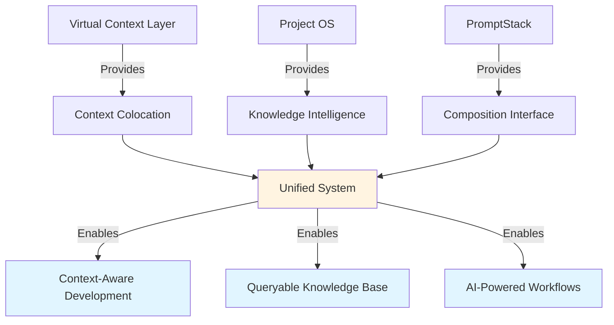
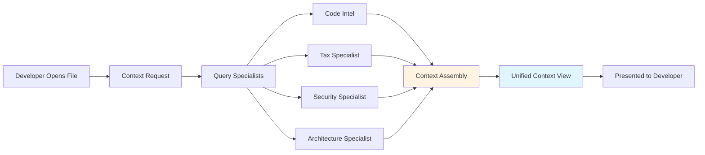
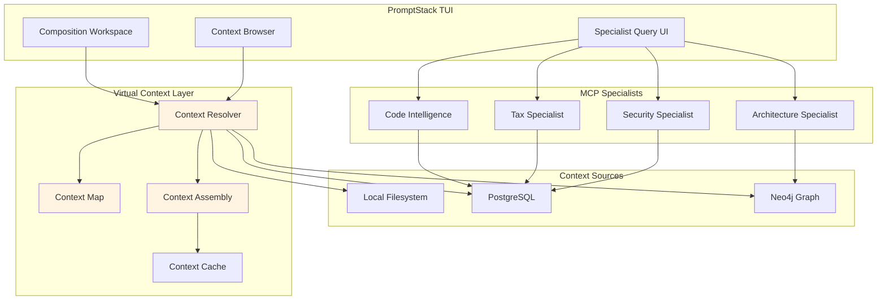
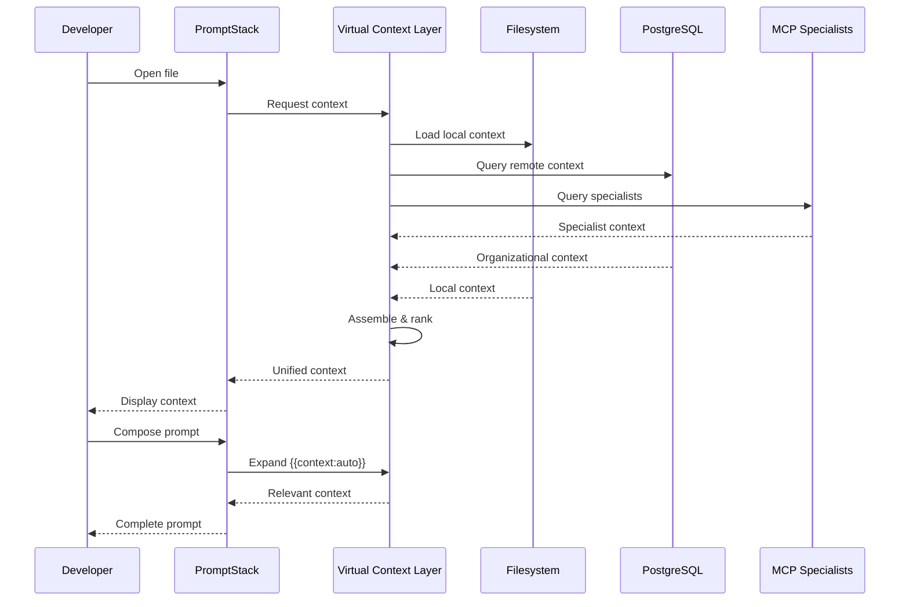

# Virtual Context Layer × Project OS: Integration Vision

**Date**: 2026-01-07  
**Status**: Ideation / Concept Exploration  
**Related**: [`virtual-context-layer.md`](virtual-context-layer.md), [`future-extensibility.md`](future-extensibility.md), [Project OS README](/Users/kyledavis/Sites/go-cli-ai/README.md)

---

## The Convergence

The Virtual Context Layer concept and Project OS vision are **naturally complementary**. They solve different aspects of the same fundamental problem: **making organizational and technical knowledge accessible, queryable, and actionable**.

### The Synthesis

**Virtual Context Layer** provides the **mechanism** for colocating documentation with code.  
**Project OS** provides the **intelligence** for understanding and querying that context.  
**PromptStack** provides the **interface** for composing and interacting with both.



---

## Yes-And: Extending the Virtual Context Layer

### 1. Context as MCP Resources

**The Idea**: Virtual context documents become **MCP resources** that specialist servers can query.

**Current Virtual Context Layer**:
```yaml
# .promptstack/context-map.yaml
mappings:
  - virtual_path: "src/internal/ai/provider.md"
    physical_path: ".promptstack/context/ai-provider-interface.md"
    scope: "file"
    target: "src/internal/ai/provider.go"
```

**Enhanced with MCP Integration**:
```yaml
# .promptstack/context-map.yaml
version: "2.0"

mappings:
  - virtual_path: "src/internal/ai/provider.md"
    physical_path: ".promptstack/context/ai-provider-interface.md"
    scope: "file"
    target: "src/internal/ai/provider.go"
    
    # NEW: MCP resource metadata
    mcp_resource:
      uri: "context://src/internal/ai/provider.md"
      mime_type: "text/markdown"
      specialists: ["code-intel", "architecture"]
      
    # NEW: Semantic metadata for specialist routing
    semantic:
      concepts: ["interface-design", "abstraction", "dependency-injection"]
      domain: "ai"
      complexity: "medium"
      business_impact: "high"
      
    # NEW: Relationships for graph queries
    relationships:
      implements: ["src/internal/ai/claude.go", "src/internal/ai/mcp.go"]
      referenced_by: ["docs/architecture/ai-domain.md"]
      depends_on: ["src/internal/platform/errors/"]
```

**MCP Server Query Example**:
```go
// Code Intelligence Specialist queries context
request := mcp.ResourceRequest{
    URI: "context://src/internal/ai/provider.md",
    Context: map[string]interface{}{
        "query": "How should I implement a new AI provider?",
        "file": "src/internal/ai/openai.go",
    },
}

response := codeIntelServer.GetResource(request)
// Returns: Interface design guide + implementation examples + related context
```

---

### 2. Context Storage: Local + Remote Hybrid

**The Idea**: Support both local files (for personal/team context) and remote databases (for organizational knowledge).

**Architecture**:
```
Context Sources (Pluggable)
├── Local Filesystem
│   └── .promptstack/context/
│       ├── personal/          # Developer-specific notes
│       ├── team/              # Team conventions
│       └── project/           # Project documentation
│
├── Remote PostgreSQL
│   └── Organizational Knowledge Base
│       ├── domain_specialists/  # Tax, Security, Compliance docs
│       ├── architecture/        # Company-wide patterns
│       └── business_context/    # Product requirements, ROI data
│
└── Graph Database (Neo4j)
    └── Relationship Network
        ├── Code → Context links
        ├── Context → Context links
        └── Business → Code links
```

**Configuration**:
```yaml
# .promptstack/config.yaml
context:
  sources:
    # Local context (always available)
    - type: "filesystem"
      path: ".promptstack/context"
      priority: 1  # Highest priority (overrides remote)
      
    # Team context (shared via Git)
    - type: "filesystem"
      path: ".promptstack/team-context"
      priority: 2
      
    # Organizational knowledge (remote)
    - type: "postgres"
      connection: "${ORG_KNOWLEDGE_DB}"
      priority: 3
      cache_ttl: "1h"
      
    # Graph relationships (remote)
    - type: "neo4j"
      connection: "${ORG_GRAPH_DB}"
      priority: 4
      cache_ttl: "30m"
```

**Benefits**:
- **Personal context** stays local (fast, private)
- **Team context** versioned with code (Git)
- **Organizational knowledge** centralized (queryable, consistent)
- **Offline-first** with intelligent caching
- **Gradual adoption** (start local, scale to remote)

---

### 3. Context Specialists: Domain-Specific Context Servers

**The Idea**: Each domain specialist (Tax, Security, Code) has its own context corpus and can contribute to the virtual context layer.

**Specialist Context Architecture**:
```
MCP Specialist Servers
├── Code Intelligence Server
│   ├── Corpus: AST fingerprints, implementation patterns
│   └── Context: "How to implement X pattern"
│
├── Tax Specialist Server
│   ├── Corpus: Tax regulations, calculation rules
│   └── Context: "Tax implications of this feature"
│
├── Security Specialist Server
│   ├── Corpus: Security best practices, vulnerability patterns
│   └── Context: "Security considerations for this code"
│
└── Architecture Specialist Server
    ├── Corpus: Design patterns, architectural decisions
    └── Context: "Why we chose this architecture"
```

**Dynamic Context Assembly**:
```go
// When developer opens src/billing/tax-calculator.go
contextRequest := ContextRequest{
    File: "src/billing/tax-calculator.go",
    Action: "implement_feature",
    Query: "Add support for Canadian GST/HST",
}

// System queries multiple specialists
contexts := []Context{
    // Code Intelligence: Implementation patterns
    codeIntel.GetContext(contextRequest),
    
    // Tax Specialist: Canadian tax rules
    taxSpecialist.GetContext(contextRequest),
    
    // Security Specialist: PII handling for tax data
    securitySpecialist.GetContext(contextRequest),
    
    // Architecture Specialist: Billing domain patterns
    architectureSpecialist.GetContext(contextRequest),
}

// Assemble into unified context view
unifiedContext := assembleContext(contexts, tokenBudget)
```

**Context Contribution Flow**:


---

### 4. Implementation Planning Graphs as Context

**The Idea**: Implementation planning graphs (from Project OS) become **queryable context** in the virtual layer.

**Graph as Context**:
```yaml
# .promptstack/context-map.yaml
mappings:
  - virtual_path: "features/usage-based-pricing/implementation-graph.md"
    physical_path: ".promptstack/graphs/usage-based-pricing.json"
    scope: "feature"
    type: "implementation-graph"
    
    # Graph metadata
    graph:
      nodes: 47
      edges: 89
      business_value: "$2.3M ARR"
      estimated_effort: "8 weeks"
      dependencies: ["billing-system", "analytics-pipeline"]
      
    # Queryable via specialists
    queries:
      - "What needs to be done for usage-based pricing?"
      - "What's the business impact of this feature?"
      - "Who's working on related tasks?"
      - "What patterns should I follow?"
```

**Graph Query Examples**:
```bash
# Query implementation graph via context layer
promptstack context query \
  --graph "usage-based-pricing" \
  --question "What do I need to implement for the billing calculation node?"

# Returns:
# - Node details (acceptance criteria, business context)
# - Related nodes (dependencies, blockers)
# - Implementation patterns (similar code, examples)
# - Business context (why it matters, ROI)
# - Team context (who to ask, related work)
```

**Integration with PromptStack**:
```markdown
# In prompt composition workspace
{{context:graph:usage-based-pricing:node:billing-calculation}}

# Expands to:
## Implementation Context: Billing Calculation Node

**Business Context:**
- Feature: Usage-based pricing
- Business Value: $2.3M ARR
- Priority: P0 (revenue-critical)

**Technical Context:**
- Pattern: Repository pattern for billing data
- Dependencies: analytics-pipeline, user-service
- Related Code: src/billing/calculator.go

**Acceptance Criteria:**
1. Calculate usage from analytics events
2. Apply tiered pricing rules
3. Handle proration for mid-cycle changes
...
```

---

### 5. Context-Aware Prompt Composition

**The Idea**: PromptStack becomes **context-aware**, automatically suggesting relevant context based on what you're working on.

**Smart Context Placeholders**:
```markdown
# In PromptStack composition workspace

I need to implement Canadian tax support in the billing system.

{{context:auto}}  # Automatically includes relevant context

# System analyzes and includes:
# - Tax specialist context (Canadian GST/HST rules)
# - Code intelligence context (billing patterns)
# - Implementation graph context (related work)
# - Security context (PII handling)
# - Architecture context (domain patterns)
```

**Context Suggestions in UI**:
```
┌─ Prompt Composition ─────────────────────────────────────┐
│ I need to implement Canadian tax support...              │
│                                                           │
│ {{context:auto}}                                          │
│                                                           │
└───────────────────────────────────────────────────────────┘

┌─ Suggested Context ──────────────────────────────────────┐
│ ✓ Tax Specialist: Canadian GST/HST Rules                 │
│ ✓ Code Intel: Billing Calculator Patterns                │
│ ✓ Security: PII Handling for Tax Data                    │
│ ○ Architecture: Billing Domain Overview                  │
│ ○ Implementation Graph: Usage-Based Pricing              │
│                                                           │
│ [Space] Toggle | [Enter] Insert | [?] Preview            │
└───────────────────────────────────────────────────────────┘
```

**Context Preview**:
```
┌─ Context Preview: Tax Specialist ────────────────────────┐
│ # Canadian GST/HST Rules                                  │
│                                                           │
│ ## Overview                                               │
│ Canada uses a two-tier sales tax system:                  │
│ - GST (5%) - Federal tax                                  │
│ - HST (13-15%) - Harmonized tax in some provinces        │
│                                                           │
│ ## Implementation Requirements                            │
│ 1. Determine customer province                           │
│ 2. Apply correct rate (GST or HST)                       │
│ 3. Handle business vs. consumer rules                    │
│                                                           │
│ Confidence: 95% | Source: Tax Specialist v2.1            │
└───────────────────────────────────────────────────────────┘
```

---

### 6. Bidirectional Context Linking with @ref Tags

**The Idea**: Combine Project OS's `@ref` tag system with virtual context layer for bidirectional linking.

**Enhanced @ref Tags**:
```markdown
# In implementation graph node
## Billing Calculation Node

**Implementation File**: @ref[src/billing/calculator.go]
**Context**: @ref[context://billing/calculation-patterns.md]
**Business Context**: @ref[graph://usage-based-pricing:business-value]
**Related Work**: @ref[graph://analytics-pipeline:usage-tracking]
**Domain Expert**: @ref[specialist://tax:canadian-rules]
```

**Bidirectional Resolution**:
```go
// When viewing src/billing/calculator.go
references := contextLayer.GetReferences("src/billing/calculator.go")

// Returns:
// - Implementation graph nodes that reference this file
// - Context documents that apply to this file
// - Business context explaining why this code exists
// - Related files and patterns
// - Domain specialists who can help
```

**Visual Representation in IDE**:
```
src/billing/calculator.go
├── 📊 Referenced by: Usage-Based Pricing Graph (Node #23)
├── 📄 Context: Billing Calculation Patterns
├── 💰 Business Value: $2.3M ARR (usage-based pricing)
├── 🔗 Related: analytics-pipeline/usage-tracker.go
└── 👤 Expert: Tax Specialist (Canadian rules)
```

---

### 7. Context Versioning and Evolution

**The Idea**: Track how context evolves alongside code, creating a **temporal knowledge graph**.

**Versioned Context**:
```yaml
# .promptstack/context-map.yaml
mappings:
  - virtual_path: "src/billing/calculator.md"
    versions:
      - version: "1.0"
        date: "2025-12-01"
        physical: ".promptstack/context/v1/billing-calculator.md"
        git_commit: "abc123"
        reason: "Initial implementation"
        
      - version: "2.0"
        date: "2026-01-07"
        physical: ".promptstack/context/v2/billing-calculator.md"
        git_commit: "def456"
        reason: "Added Canadian tax support"
        changes:
          - "Added GST/HST calculation rules"
          - "Updated for multi-currency support"
          - "Added tax specialist integration"
```

**Temporal Queries**:
```bash
# What context was available when this code was written?
promptstack context history \
  --file src/billing/calculator.go \
  --commit abc123

# How has context evolved?
promptstack context diff \
  --file src/billing/calculator.md \
  --from v1.0 \
  --to v2.0

# What changed in the last sprint?
promptstack context changes \
  --since "2 weeks ago" \
  --domain billing
```

---

### 8. Context Quality Metrics and Specialist Confidence

**The Idea**: Track context quality and specialist confidence to identify knowledge gaps.

**Context Health Dashboard**:
```yaml
context_health:
  coverage: 87%  # Files with context
  staleness: 8%  # Context older than 90 days
  completeness: 92%  # Recommended context present
  
  by_domain:
    billing:
      coverage: 95%
      specialists: ["tax", "security", "code-intel"]
      confidence: 0.89
      
    analytics:
      coverage: 78%
      specialists: ["code-intel"]
      confidence: 0.72
      gaps: ["No business context", "Missing architecture docs"]
      
  specialist_confidence:
    tax_specialist:
      avg_confidence: 0.91
      low_confidence_queries: 12
      needs_training: ["Quebec provincial tax", "B2B exemptions"]
      
    security_specialist:
      avg_confidence: 0.85
      low_confidence_queries: 8
      needs_training: ["OAuth2 flows", "GDPR compliance"]
```

**Proactive Context Suggestions**:
```
┌─ Context Health Alert ───────────────────────────────────┐
│ ⚠️  Low context coverage detected                         │
│                                                           │
│ File: src/analytics/usage-tracker.go                      │
│ Coverage: 45% (below 80% threshold)                       │
│                                                           │
│ Missing Context:                                          │
│ • Business context (why this exists)                      │
│ • Architecture patterns (how it fits)                     │
│ • Implementation graph link                               │
│                                                           │
│ [Create Context] [Ignore] [Remind Later]                 │
└───────────────────────────────────────────────────────────┘
```

---

## Implementation Roadmap

### Phase 1: Foundation (Months 1-3)
**Goal**: Establish basic virtual context layer with local storage

- [ ] Implement context mapping format (YAML)
- [ ] Build context resolution engine
- [ ] Add CLI commands for context management
- [ ] Integrate with PromptStack composition workspace
- [ ] Support local filesystem context sources

**Deliverables**:
- Context map schema v1.0
- Basic context CLI (`promptstack context`)
- Context placeholders in prompts (`{{context:path}}`)

### Phase 2: MCP Integration (Months 4-6)
**Goal**: Connect context layer to MCP specialist servers

- [ ] Define MCP resource protocol for context
- [ ] Implement context as MCP resources
- [ ] Build specialist context contribution system
- [ ] Add semantic metadata for routing
- [ ] Create context assembly engine

**Deliverables**:
- MCP context resource specification
- Specialist context API
- Multi-specialist context assembly

### Phase 3: Remote Storage (Months 7-9)
**Goal**: Add PostgreSQL and Neo4j support for organizational knowledge

- [ ] Implement PostgreSQL context source
- [ ] Add Neo4j graph relationships
- [ ] Build context synchronization
- [ ] Add caching layer
- [ ] Implement offline-first mode

**Deliverables**:
- Hybrid local/remote context storage
- Context sync protocol
- Offline capability

### Phase 4: Graph Integration (Months 10-12)
**Goal**: Integrate implementation planning graphs as context

- [ ] Define graph-as-context format
- [ ] Build graph query engine
- [ ] Add @ref tag bidirectional linking
- [ ] Implement graph context in prompts
- [ ] Create graph visualization in TUI

**Deliverables**:
- Graph context queries
- Bidirectional @ref resolution
- Graph-aware prompt composition

### Phase 5: Intelligence Layer (Months 13-15)
**Goal**: Add AI-powered context features

- [ ] Implement context-aware suggestions
- [ ] Build context quality metrics
- [ ] Add automatic context generation
- [ ] Create context health dashboard
- [ ] Implement proactive context alerts

**Deliverables**:
- Smart context suggestions
- Context health monitoring
- AI-generated context

---

## Use Case Examples

### Use Case 1: Developer Implements New Feature

**Scenario**: Developer needs to add Canadian tax support to billing system.

**Traditional Workflow**:
1. Search Slack for "Canadian tax"
2. Ask team lead for context
3. Read through old PRs
4. Hunt for related code
5. Hope documentation is up to date
6. **Time**: 2-3 hours of context gathering

**With Virtual Context Layer + Project OS**:
1. Open `src/billing/calculator.go`
2. System automatically shows:
   - Tax specialist context (Canadian GST/HST rules)
   - Implementation graph node (acceptance criteria, business value)
   - Related code patterns (similar implementations)
   - Security considerations (PII handling)
   - Architecture patterns (billing domain)
3. Compose prompt with `{{context:auto}}`
4. Get AI suggestions with full context
5. **Time**: 15 minutes of context gathering

**Context Assembly**:
```markdown
# Automatically assembled context

## Business Context (from Implementation Graph)
- Feature: Usage-Based Pricing
- Business Value: $2.3M ARR
- Priority: P0 (revenue-critical)
- Deadline: Q1 2026

## Tax Rules (from Tax Specialist)
- Canadian GST: 5% federal
- HST rates: 13-15% by province
- Business vs. consumer rules
- Exemptions and special cases

## Implementation Patterns (from Code Intelligence)
- Use TaxCalculator interface
- Follow repository pattern
- See: src/billing/us-tax-calculator.go (similar)

## Security Requirements (from Security Specialist)
- Tax data is PII - encrypt at rest
- Audit all tax calculations
- Follow PIPEDA compliance

## Architecture (from Architecture Specialist)
- Billing domain uses DDD patterns
- Tax calculation is a domain service
- Integrate with analytics for usage data
```

---

### Use Case 2: Product Manager Plans Feature

**Scenario**: PM needs to understand feasibility and effort for new feature.

**Traditional Workflow**:
1. Schedule meetings with architects
2. Wait for technical assessment
3. Get rough estimates
4. Iterate on requirements
5. **Time**: 1-2 weeks

**With Virtual Context Layer + Project OS**:
1. Query implementation graph: "What's needed for feature X?"
2. System returns:
   - Graph nodes with effort estimates
   - Dependencies and blockers
   - Business context and ROI
   - Related work and patterns
3. Refine requirements with context
4. Share graph with team
5. **Time**: 1-2 days

**Query Example**:
```bash
promptstack context query \
  --graph "usage-based-pricing" \
  --question "What's the effort and dependencies?"

# Returns:
# - 47 nodes, 89 edges
# - Estimated effort: 8 weeks
# - Dependencies: analytics-pipeline (in progress), billing-system (stable)
# - Business value: $2.3M ARR
# - Risk factors: Tax compliance complexity, multi-currency support
# - Recommended approach: Phase 1 (US only), Phase 2 (Canada), Phase 3 (EU)
```

---

### Use Case 3: New Developer Onboarding

**Scenario**: New developer joins team, needs to understand codebase.

**Traditional Workflow**:
1. Read outdated README
2. Ask team members questions
3. Explore code randomly
4. Make mistakes, learn slowly
5. **Time**: 2-4 weeks to productivity

**With Virtual Context Layer + Project OS**:
1. Clone repo with context layer
2. Browse virtual context alongside code
3. See business context for each file
4. Query specialists for explanations
5. Follow implementation graphs for features
6. **Time**: 3-5 days to productivity

**Onboarding Experience**:
```
# Developer opens src/billing/calculator.go

┌─ File Context ───────────────────────────────────────────┐
│ 📄 src/billing/calculator.go                              │
│                                                           │
│ 💰 Business Context:                                      │
│    Core billing calculation engine for usage-based        │
│    pricing. Handles $2.3M ARR. Critical path.            │
│                                                           │
│ 🏗️  Architecture:                                         │
│    Domain service in billing domain. Uses repository      │
│    pattern. Integrates with analytics for usage data.    │
│                                                           │
│ 🔗 Related:                                               │
│    • Implementation Graph: usage-based-pricing            │
│    • Pattern: src/billing/us-tax-calculator.go           │
│    • Tests: src/billing/calculator_test.go               │
│                                                           │
│ 👤 Ask:                                                   │
│    • Tax Specialist (tax rules)                          │
│    • Code Intelligence (implementation patterns)          │
│    • Architecture Specialist (domain design)              │
│                                                           │
│ [?] Learn More | [Q] Query Specialist | [G] View Graph   │
└───────────────────────────────────────────────────────────┘
```

---

## Technical Architecture

### System Components



### Data Flow



---

## Key Benefits

### For Developers
- **Context at fingertips**: No hunting for documentation
- **AI-powered assistance**: Smart suggestions with full context
- **Faster onboarding**: Self-documenting codebase
- **Better decisions**: Understand business impact

### For Teams
- **Shared knowledge**: Centralized, queryable context
- **Consistent patterns**: Discoverable best practices
- **Reduced meetings**: Context answers questions
- **Knowledge preservation**: Survives team changes

### For Organizations
- **Queryable knowledge base**: Business + code unified
- **ROI visibility**: Connect code to business value
- **Faster delivery**: Reduced context-gathering time
- **Quality improvement**: Better-informed decisions

---

## Open Questions

1. **Context Ownership**: Who maintains organizational context? (Proposed: Knowledge & Context Department)

2. **Context Freshness**: How to keep context up-to-date? (Proposed: Git hooks + AI-powered staleness detection)

3. **Context Conflicts**: What if local and remote context disagree? (Proposed: Priority system with local override)

4. **Privacy**: How to handle sensitive context? (Proposed: Encryption + access control + local-only option)

5. **Performance**: How to keep context queries fast? (Proposed: Aggressive caching + incremental updates)

6. **Adoption**: How to encourage context creation? (Proposed: AI-generated context + quality metrics + gamification)

---

## Next Steps

1. **Prototype context mapping format** - Define YAML schema
2. **Build minimal CLI** - Basic context commands
3. **Integrate with PromptStack** - Context placeholders
4. **Test with real project** - Apply to PromptStack itself
5. **Gather feedback** - Validate with developers
6. **Iterate on design** - Refine based on usage

---

## Conclusion

The Virtual Context Layer bridges PromptStack and Project OS by providing a **unified mechanism for context colocation, storage, and retrieval**. It transforms documentation from static files into a **queryable, intelligent knowledge layer** that enhances every aspect of development.

**The Vision**: A world where developers never hunt for context, where business knowledge is always accessible, where AI assistance is truly context-aware, and where organizational memory is preserved and queryable.

This isn't just better documentation—it's a **new way of working** where context flows naturally from business to code and back again.

---

**Status**: Concept exploration - ready for prototyping  
**Next**: Build minimal viable implementation  
**Related**: 
- [`virtual-context-layer.md`](virtual-context-layer.md) - Core concept
- [`future-extensibility.md`](future-extensibility.md) - PromptStack evolution
- [Project OS README](/Users/kyledavis/Sites/go-cli-ai/README.md) - Grander vision