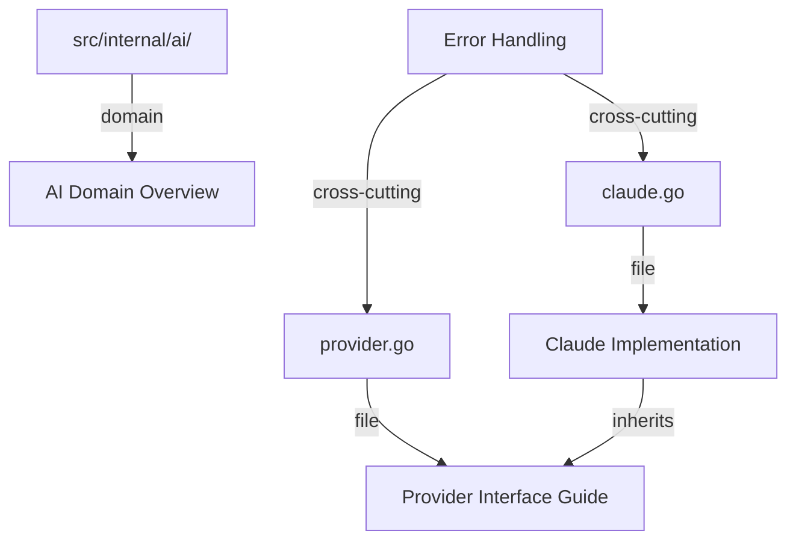

# Virtual Context Layer: A Meta-Documentation System for AI-Assisted Development

**Date**: 2026-01-07  
**Status**: Ideation / Concept Exploration  
**Related**: [`future-extensibility.md`](future-extensibility.md), [`what-we-are-building.md`](../plans/fresh-build/what-we-are-building.md)

---

## The Core Problem

As AI becomes more integrated into development workflows, we're seeing an explosion of context documents:
- Feature specifications
- Implementation guides
- Architecture decisions
- Domain knowledge
- Rules and constraints
- Testing strategies
- Migration guides

**Current Reality**: These documents either:
1. **Live far from code** (in `/docs`) - hard to discover, easy to forget
2. **Clutter the codebase** - inline comments become novels, README files everywhere
3. **Get out of sync** - documentation drifts from implementation

## The Vision: Virtual Colocation

**What if documentation could be "virtually" colocated with code without physically being there?**

Think of it like:
- **Git** - tracks changes without storing full copies
- **Symbolic links** - point to content elsewhere
- **Virtual file systems** - present a unified view of distributed content

---

## Conceptual Model

### 1. Physical vs Virtual Reality

**Physical Storage** (centralized, organized):
```
.promptstack/
└── context/
    ├── domains/
    │   ├── ai-domain-overview.md
    │   ├── storage-domain-overview.md
    │   └── editor-domain-overview.md
    ├── implementations/
    │   ├── ai-provider-interface.md
    │   ├── claude-implementation-guide.md
    │   └── repository-pattern-guide.md
    ├── architecture/
    │   ├── error-handling-strategy.md
    │   ├── dependency-injection-pattern.md
    │   └── interface-design-principles.md
    └── features/
        ├── placeholder-system-design.md
        ├── vim-mode-architecture.md
        └── history-sync-strategy.md
```

**Virtual View** (in IDE/AI, colocated with code):
```
src/
├── internal/
│   ├── ai/
│   │   ├── 📄 [virtual] domain-overview.md          ← Directory-level
│   │   ├── provider.go
│   │   ├── 📄 [virtual] provider-interface.md       ← File-level
│   │   ├── claude.go
│   │   └── 📄 [virtual] claude-implementation.md    ← File-level
│   │
│   ├── storage/
│   │   ├── 📄 [virtual] domain-overview.md
│   │   ├── repository.go
│   │   └── 📄 [virtual] repository-pattern.md
│   │
│   └── editor/
│       ├── 📄 [virtual] domain-overview.md
│       ├── buffer.go
│       └── placeholder.go
│           └── 📄 [virtual] placeholder-design.md
```

### 2. The Mapping Database

A lightweight index tracking relationships:

```yaml
# .promptstack/context-map.yaml
version: "1.0"

mappings:
  # Domain-level context (applies to entire directory)
  - virtual_path: "src/internal/ai/domain-overview.md"
    physical_path: ".promptstack/context/domains/ai-domain-overview.md"
    scope: "directory"
    target: "src/internal/ai/"
    tags: ["architecture", "ai", "domain"]
    
  # File-level context (specific to one file)
  - virtual_path: "src/internal/ai/provider-interface.md"
    physical_path: ".promptstack/context/implementations/ai-provider-interface.md"
    scope: "file"
    target: "src/internal/ai/provider.go"
    tags: ["interface", "abstraction", "scalability"]
    
  - virtual_path: "src/internal/ai/claude-implementation.md"
    physical_path: ".promptstack/context/implementations/claude-implementation-guide.md"
    scope: "file"
    target: "src/internal/ai/claude.go"
    tags: ["implementation", "claude", "api"]
    inherits: ["src/internal/ai/provider-interface.md"]
    
  # Symbol-level context (specific to function/type)
  - virtual_path: "src/internal/ai/provider.go:AIProvider"
    physical_path: ".promptstack/context/architecture/interface-design-principles.md"
    scope: "symbol"
    target: "src/internal/ai/provider.go"
    symbol: "AIProvider"
    tags: ["interface", "design-pattern"]
    
  # Cross-cutting context (applies to multiple locations)
  - virtual_path: "error-handling-strategy.md"
    physical_path: ".promptstack/context/architecture/error-handling-strategy.md"
    scope: "cross-cutting"
    targets:
      - "src/internal/platform/errors/"
      - "src/internal/ai/client.go:handleAPIError"
      - "src/ui/*/error handling"
    tags: ["architecture", "error-handling", "cross-cutting"]
```

### 3. Context Hierarchy & Inheritance

**Multi-level Context**:
```
Project Level
  └── Domain Level (src/internal/ai/)
      └── File Level (provider.go)
          └── Symbol Level (AIProvider interface)
```

**Context Resolution** (when AI requests context for `src/internal/ai/claude.go`):
1. **Project-level**: Architecture, conventions, style guide
2. **Domain-level**: AI domain overview, patterns
3. **File-level**: Claude implementation guide
4. **Inherited**: Provider interface design (from parent)
5. **Related**: Other AI provider implementations

---

## Key Features

### 1. **Scope Types**

**Directory Scope**:
- Applies to all files in directory and subdirectories
- Perfect for domain overviews, architectural patterns
- Example: AI domain overview applies to all files in `internal/ai/`

**File Scope**:
- Specific to one source file
- Implementation guides, file-specific decisions
- Example: Claude implementation guide for `claude.go`

**Symbol Scope**:
- Attached to specific functions, types, interfaces
- Design rationale, usage examples
- Example: Interface design principles for `AIProvider`

**Cross-Cutting Scope**:
- Applies to multiple unrelated locations
- Architectural patterns, conventions
- Example: Error handling strategy across all domains

### 2. **Context Inheritance**

Child contexts can inherit from parent contexts:

```yaml
- virtual_path: "src/internal/ai/claude.go"
  inherits:
    - "src/internal/ai/domain-overview.md"      # Domain context
    - "src/internal/ai/provider-interface.md"   # Interface context
  overrides:
    - "claude-specific-considerations.md"       # File-specific
```

### 3. **Dynamic Context Assembly**

When AI needs context, the system assembles it dynamically:

```
Request: Context for src/internal/ai/claude.go

Assembly:
1. Load project-level context (architecture, conventions)
2. Load domain-level context (AI domain overview)
3. Load file-level context (Claude implementation guide)
4. Load inherited context (provider interface design)
5. Load related context (other provider implementations)
6. Apply filters (relevance, token budget)
7. Return assembled context
```

### 4. **Semantic Linking**

Link by concepts, not just paths:

```yaml
concepts:
  - name: "error-handling-strategy"
    description: "How we handle errors across the application"
    applies_to:
      - pattern: "src/internal/platform/errors/**"
      - pattern: "src/internal/*/client.go"
        symbols: ["handleError", "wrapError"]
      - pattern: "src/ui/**"
        condition: "contains error handling"
    
  - name: "interface-design-pattern"
    description: "How we design interfaces for abstraction"
    applies_to:
      - pattern: "src/internal/**/interface.go"
      - pattern: "src/internal/**/*_interface.go"
      - symbols: ["*Provider", "*Repository", "*Source"]
```

### 5. **Temporal Context**

Track when and why context was added:

```yaml
- virtual_path: "src/internal/storage/repository-pattern.md"
  physical_path: ".promptstack/context/implementations/repository-pattern-guide.md"
  metadata:
    added: "2026-01-07"
    author: "architect-mode"
    reason: "Scalability review - Phase 1 abstractions"
    related_pr: "#123"
    related_milestone: "M39"
    last_updated: "2026-01-07"
    version: "1.0"
```

---

## Benefits

### For Developers

**Clean Codebase**:
- No documentation clutter in source files
- Code remains focused on implementation
- Documentation doesn't interfere with code review

**Discoverable Context**:
- IDE shows virtual docs alongside code
- Context appears exactly where it's needed
- No hunting through `/docs` directories

**Versioned with Code**:
- Context map is version controlled
- Documentation evolves with code
- Git history shows context changes

**Easy to Maintain**:
- Centralized documentation storage
- Virtual links are lightweight
- Update once, applies everywhere

### For AI

**Rich Context**:
- Access deep documentation without bloating prompts
- Understand architectural decisions
- See relationships between components

**Contextual Awareness**:
- Knows what docs are relevant to current file
- Can traverse context hierarchy
- Understands domain boundaries

**Relationship Understanding**:
- Sees connections between code and concepts
- Understands inheritance and dependencies
- Can reason about system architecture

**Efficient Token Usage**:
- Loads only relevant context
- Filters by scope and relevance
- Respects token budgets

### For Teams

**Consistent Documentation**:
- Centralized, easier to maintain standards
- Shared templates and patterns
- Unified documentation style

**Onboarding**:
- New devs see context right where they need it
- Self-documenting codebase
- Clear architectural guidance

**Knowledge Preservation**:
- Architectural decisions stay linked to code
- Historical context preserved
- Rationale documented

**Collaboration**:
- Shared understanding of complex systems
- Clear communication of intent
- Reduced knowledge silos

---

## Implementation Approaches

### Minimal Viable Version

**1. Simple Mapping File**:
```yaml
# .promptstack/context-map.yaml
mappings:
  - virtual: "src/internal/ai/provider.md"
    physical: ".promptstack/context/ai-provider.md"
    target: "src/internal/ai/provider.go"
```

**2. CLI Commands**:
```bash
# View virtual context for a file
promptstack context show src/internal/ai/provider.go

# List all context mappings
promptstack context list

# Add new context mapping
promptstack context add \
  --target src/internal/ai/claude.go \
  --doc .promptstack/context/claude-guide.md

# Validate context mappings
promptstack context validate
```

**3. AI Integration**:
```go
// When AI requests context for a file
func GetContextForFile(filePath string) ([]ContextDoc, error) {
    mappings := loadContextMap()
    
    // Find all applicable context
    var contexts []ContextDoc
    for _, mapping := range mappings {
        if mapping.AppliesTo(filePath) {
            doc := loadContextDoc(mapping.PhysicalPath)
            contexts = append(contexts, doc)
        }
    }
    
    return contexts, nil
}
```

### Advanced Version

**1. LSP Integration**:
- Virtual docs appear in IDE natively
- Hover over code to see context
- Jump to context definition
- Context appears in autocomplete

**2. Git Hooks**:
```bash
# Pre-commit hook
promptstack context validate
promptstack context check-stale

# Post-merge hook
promptstack context update-index
```

**3. Web UI**:
- Visual context graph
- Browse relationships
- Search across context
- Edit context in place

**4. AI-Powered Features**:
- Suggest missing context
- Detect stale context
- Auto-generate context from code
- Context quality scoring

**5. Context Versioning**:
```yaml
- virtual_path: "src/internal/ai/provider.md"
  versions:
    - version: "1.0"
      date: "2026-01-01"
      physical: ".promptstack/context/v1/ai-provider.md"
    - version: "2.0"
      date: "2026-01-07"
      physical: ".promptstack/context/v2/ai-provider.md"
      changes: "Added MCP provider support"
```

---

## Integration with PromptStack

### Natural Evolution

**Today**: PromptStack manages prompt templates
**Tomorrow**: PromptStack manages code context

The prompt library becomes a **context library**:
- **Workflows** → Implementation patterns
- **Commands** → Code operations
- **Rules** → Architectural constraints
- **Decorations** → Context annotations

The composition workspace becomes a **context-aware editor**:
- See relevant context as you code
- AI suggestions informed by virtual docs
- Context placeholders in prompts
- Real-time context assembly

### Feature Mapping

| PromptStack Feature | Context Layer Feature |
|---------------------|----------------------|
| Prompt Library | Context Library |
| Fuzzy Search | Context Search |
| Placeholder System | Context Variables |
| History Browser | Context History |
| File References | Context Links |
| AI Suggestions | Context-Aware Suggestions |
| Validation | Context Linting |

### New Capabilities

**Context Composition**:
```markdown
# In a prompt template
{{context:src/internal/ai/provider.go}}
{{context:domain:ai}}
{{context:concept:error-handling}}
```

**Context Queries**:
```
"Show me all context related to error handling"
"What architectural decisions affect the AI domain?"
"Find context added in the last sprint"
"List stale context that needs updating"
```

**Context Graph Visualization**:


---

## Interesting Extensions

### 1. Context as Code

Embed context references directly in code:

```go
//go:context .promptstack/context/provider-interface.md
//go:context-concept error-handling-strategy
type AIProvider interface {
    GetSuggestions(ctx context.Context, prompt string) ([]Suggestion, error)
}
```

### 2. Context Composition

Compose complex context from simpler pieces:

```yaml
- virtual_path: "src/internal/ai/complete-guide.md"
  composed_from:
    - "domain-overview.md"
    - "interface-design.md"
    - "implementation-patterns.md"
    - "testing-strategies.md"
    - "migration-guide.md"
  assembly_order: "hierarchical"
```

### 3. Context Queries with Filters

```yaml
query:
  concept: "error-handling"
  domain: "ai"
  scope: ["file", "symbol"]
  tags: ["implementation", "best-practices"]
  date_range: "last-30-days"
  exclude_stale: true
```

### 4. Context Linting

Validate context completeness:

```bash
$ promptstack context lint

Warnings:
  - src/internal/ai/provider.go: No implementation guide
  - src/internal/storage/: Domain overview missing
  
Suggestions:
  - Add context for new specialist/ directory
  - Update context for database.go (references old schema)
  
Stale Context:
  - src/internal/history/database.go: Last updated 90 days ago
```

### 5. Context Metrics

Track context health:

```yaml
metrics:
  coverage: 85%  # Percentage of files with context
  staleness: 12% # Percentage of stale context
  completeness: 78% # Percentage of recommended context present
  
by_domain:
  ai: 95%
  storage: 80%
  editor: 90%
  ui: 70%
```

---

## Challenges & Solutions

### Challenge 1: Context Staleness

**Problem**: Context gets out of sync with code

**Solutions**:
- Git hooks to detect changes
- Automated staleness detection
- Context version tracking
- Regular context audits
- AI-powered context updates

### Challenge 2: Context Overload

**Problem**: Too much context, hard to find relevant info

**Solutions**:
- Hierarchical context (project → domain → file → symbol)
- Smart filtering by relevance
- Token budget management
- Context summarization
- Lazy loading

### Challenge 3: IDE Integration

**Problem**: Different IDEs, different capabilities

**Solutions**:
- LSP protocol extension
- IDE-agnostic CLI tools
- Web-based context viewer
- Standard context format
- Plugin architecture

### Challenge 4: Context Conflicts

**Problem**: Multiple contexts say different things

**Solutions**:
- Context precedence rules (symbol > file > domain > project)
- Conflict detection
- Version tracking
- Explicit overrides
- Validation rules

### Challenge 5: Performance

**Problem**: Context resolution might be slow

**Solutions**:
- Context index caching
- Lazy loading
- Incremental updates
- Parallel resolution
- Smart prefetching

---

## Philosophical Questions

### Is context "part of" the code or "about" the code?

**Both**: Context is metadata that enhances code understanding without being executable. It's like type annotations - not required for execution, but essential for comprehension.

### Should context be versioned with code or separately?

**With code**: Context map should be version controlled alongside code. Physical context documents can be versioned separately but referenced by version in the map.

### Who owns context - developers or AI?

**Collaborative**: Developers create and maintain context. AI consumes and suggests improvements. Both benefit from rich, accurate context.

### What's the right granularity?

**Multi-level**: Support all levels (project, domain, file, symbol) and let users choose. Different contexts need different granularity.

---

## Wild Ideas

### Context-Aware Code Generation

AI generates code with context already mapped:

```go
// Generated by AI with context
//go:context .promptstack/context/generated/provider-impl-2026-01-07.md
type NewProvider struct {
    // Implementation
}
```

### Context Marketplace

Share context libraries:

```bash
promptstack context install @promptstack/go-best-practices
promptstack context install @company/internal-patterns
```

### Context Diffing

See how context evolved:

```bash
promptstack context diff HEAD~10 HEAD
```

### Context-Driven Development

Write context first, generate code from it:

```bash
promptstack generate --from-context ai-provider-spec.md
```

### Context Analytics

Understand context usage:

```
Most referenced context: error-handling-strategy.md (127 files)
Least referenced: old-migration-guide.md (0 files)
Context with highest AI query rate: provider-interface.md
```

---

## Next Steps for Exploration

1. **Prototype the mapping format** - What's the minimal viable schema?
2. **Build a simple CLI** - Prove the concept works
3. **Test with real code** - Apply to PromptStack itself
4. **Measure impact** - Does it actually help AI understanding?
5. **Gather feedback** - What do developers think?
6. **Iterate on design** - Refine based on real usage

---

## Conclusion

The Virtual Context Layer concept addresses a fundamental challenge in AI-assisted development: **how to provide rich context without cluttering the codebase**.

By creating a meta-layer that virtually colocates documentation with code, we get:
- ✅ Clean, focused source code
- ✅ Rich, discoverable context
- ✅ Efficient AI understanding
- ✅ Maintainable documentation
- ✅ Scalable knowledge management

This could be a game-changer for how we document and understand complex codebases in the AI era.

---

**Status**: Concept exploration - ready for prototyping  
**Next**: Build minimal viable implementation  
**Related**: See [`future-extensibility.md`](future-extensibility.md) for broader architectural vision