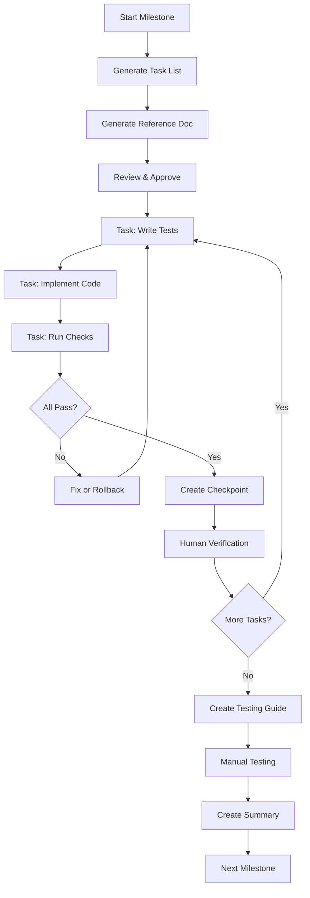

# PromptStack Fresh Build - Development System

## Overview

This directory contains a comprehensive, AI-assisted development system for building PromptStack from scratch using Test-Driven Development (TDD) and Go best practices.

## What's Included

### 📋 Planning Documents

1. **[`milestones.md`](milestones.md:1)** - 38 granular milestones with clear deliverables and test criteria
2. **[`project-structure.md`](project-structure.md:1)** - Go-idiomatic architecture with domain-driven design
3. **[`go-style-guide.md`](go-style-guide.md:1)** - Comprehensive Go coding standards for AI assistants
4. **[`go-testing-guide.md`](go-testing-guide.md:1)** - Effect-based testing patterns for TUI applications

### 🚀 Execution System

5. **[`milestone-execution-prompt.md`](milestone-execution-prompt.md:1)** - The main prompt for AI-assisted development
6. **[`HOW-TO-USE.md`](HOW-TO-USE.md:1)** - Step-by-step guide for using the system
7. **[`milestones/progress.md`](milestones/progress.md:1)** - Real-time progress tracking

## Quick Start

### For Developers

1. **Read** [`HOW-TO-USE.md`](HOW-TO-USE.md:1) to understand the workflow
2. **Copy** [`milestone-execution-prompt.md`](milestone-execution-prompt.md:1) into a new AI chat (Code mode)
3. **Start** with Milestone 1 and follow the TDD process
4. **Track** progress in [`milestones/progress.md`](milestones/progress.md:1)

### For AI Assistants

When a developer provides [`milestone-execution-prompt.md`](milestone-execution-prompt.md:1):
1. Confirm understanding of the TDD process
2. Ask which milestone to start
3. Generate task list and reference document
4. Execute tasks one at a time with verification stops
5. Create comprehensive checkpoints
6. Ensure build and tests always pass

## System Features

### ✅ Comprehensive Tracking

- **Task-level checkpoints** after each completion
- **Milestone summaries** with metrics and learnings
- **Progress dashboard** showing overall status
- **Testing guides** for manual verification

### ✅ Quality Assurance

- **TDD enforcement** - tests before implementation
- **Style guide compliance** - automated checks
- **Testing guide compliance** - pattern verification
- **Build verification** - no broken builds allowed
- **Coverage tracking** - maintain >80% coverage

### ✅ Documentation

- **Task lists** - concise, actionable items
- **Reference documents** - detailed implementation guides
- **Checkpoint documents** - complete task history
- **Testing guides** - step-by-step manual testing
- **Milestone summaries** - completion reports

### ✅ Flexibility

- **Rollback strategy** - handle failures gracefully
- **Dependency tracking** - explicit task dependencies
- **Integration points** - called out explicitly
- **Progress metrics** - coverage, tests, build time
- **Pause/resume** - pick up where you left off

## File Structure

```
docs/plans/fresh-build/
├── README.md                          # This file
├── HOW-TO-USE.md                      # Usage guide
├── milestone-execution-prompt.md      # Main AI prompt
├── milestones.md                      # 38 milestones
├── project-structure.md               # Architecture guide
├── go-style-guide.md                  # Coding standards
├── go-testing-guide.md                # Testing patterns
└── milestones/
    ├── progress.md                    # Progress tracking
    ├── M1-task-list.md                # Generated per milestone
    ├── M1-reference.md                # Generated per milestone
    ├── M1-testing-guide.md            # Generated per milestone
    ├── M1-summary.md                  # Generated per milestone
    └── M1-checkpoints/                # Generated per task
        ├── task-1-checkpoint.md
        ├── task-2-checkpoint.md
        └── ...
```

## Development Workflow



## Key Principles

1. **TDD First** - Always write tests before implementation
2. **One Task at a Time** - Complete fully before moving on
3. **Stop and Verify** - Human verification after each task
4. **Build Must Pass** - Never proceed with failures
5. **Follow Guidelines** - Style and testing guides are mandatory
6. **Document Everything** - Comprehensive checkpoints and summaries
7. **Quality Over Speed** - Correctness is more important than velocity

## Milestone Groups

### Foundation (1-6)
Bootstrap, TUI shell, file I/O, editor, auto-save, undo/redo

### Library Integration (7-10)
Load library, browse, search, insert prompts

### Placeholders (11-14)
Parse, navigate, edit text/list placeholders

### History (15-17)
SQLite setup, sync, browser

### Commands & Files (18-22)
Command system, palette, file references

### Prompt Management (23-26)
Validation, results, creator, editor

### AI Integration (27-33)
API client, context selection, tokens, suggestions, diff

### Vim Mode (34-35)
State machine, keybindings

### Polish (36-38)
Settings, responsive layout, error handling

## Success Metrics

Track these throughout development:

- **Test Coverage**: Target >80% for all packages
- **Build Time**: Monitor for performance regressions
- **Test Count**: Growing test suite indicates progress
- **Passing Tests**: Should always be 100%
- **Code Quality**: Style guide compliance
- **Documentation**: Complete checkpoints and summaries

## Benefits of This System

### For Developers

- ✅ Clear roadmap with 38 well-defined milestones
- ✅ Confidence through comprehensive testing
- ✅ Quality assurance through guideline enforcement
- ✅ Progress visibility through tracking documents
- ✅ Easy to pause and resume development
- ✅ Manual testing guides for verification

### For AI Assistants

- ✅ Structured process to follow
- ✅ Clear stopping points for verification
- ✅ Comprehensive context through reference docs
- ✅ Explicit guidelines to follow
- ✅ Checkpoint templates for documentation
- ✅ Rollback strategy for failures

### For the Project

- ✅ High-quality, well-tested codebase
- ✅ Comprehensive documentation
- ✅ Maintainable architecture
- ✅ Clear development history
- ✅ Reproducible build process
- ✅ Easy onboarding for new developers

## Getting Started

### First Time Setup

1. Read [`HOW-TO-USE.md`](HOW-TO-USE.md:1) completely
2. Review [`milestones.md`](milestones.md:1) to understand the scope
3. Familiarize yourself with [`go-style-guide.md`](go-style-guide.md:1)
4. Understand [`go-testing-guide.md`](go-testing-guide.md:1) patterns
5. Review [`project-structure.md`](project-structure.md:1) architecture

### Starting Development

1. Open a new AI chat in Code mode
2. Copy entire contents of [`milestone-execution-prompt.md`](milestone-execution-prompt.md:1)
3. Paste into chat
4. Follow the AI's prompts
5. Start with Milestone 1

### Monitoring Progress

Check [`milestones/progress.md`](milestones/progress.md:1) anytime to see:
- Current milestone and task
- Overall completion percentage
- Test statistics and coverage
- Recent activity
- Cumulative metrics

## Tips for Success

1. **Trust the Process** - The structure ensures quality
2. **Don't Skip Verification** - Each stop point is important
3. **Test Manually** - Follow testing guides at milestone end
4. **Commit Frequently** - After each task completion
5. **Keep Sessions Focused** - One milestone per session ideal
6. **Provide Clear Feedback** - Help the AI improve
7. **Document Learnings** - Add notes to checkpoints

## Troubleshooting

### Common Issues

**AI skips TDD**: Remind it to write tests first

**AI doesn't stop**: Remind it to stop after each task

**Tests failing**: Review checkpoint, run tests yourself, provide guidance

**Guidelines not followed**: Point out violations, request fixes

**Lost context**: Check last checkpoint, review progress.md, resume from last task

See [`HOW-TO-USE.md`](HOW-TO-USE.md:1) for detailed troubleshooting.

## Contributing

When improving this system:

1. Update relevant documents
2. Test changes with a sample milestone
3. Document the improvement
4. Update this README if needed

## Version History

- **v1.0** (2026-01-07) - Initial comprehensive system
  - 38 granular milestones
  - Complete execution prompt
  - Style and testing guides
  - Progress tracking system
  - Checkpoint documentation
  - Testing guides per milestone

## Next Steps

1. **Review** all documents to understand the system
2. **Start** with Milestone 1: Bootstrap & Config
3. **Follow** the TDD process strictly
4. **Track** progress in the milestones directory
5. **Test** manually at each milestone completion
6. **Iterate** through all 38 milestones

## Support

For questions or issues:

1. Check [`HOW-TO-USE.md`](HOW-TO-USE.md:1) for guidance
2. Review checkpoint documents for context
3. Consult style/testing guides for patterns
4. Ask the AI assistant for clarification

---

**Ready to build?** Start with [`HOW-TO-USE.md`](HOW-TO-USE.md:1) and begin your journey through the 38 milestones!

**Goal**: Build a high-quality, well-tested, maintainable PromptStack application using disciplined TDD and Go best practices.

**Philosophy**: Quality over speed. Every line of code tested. Every milestone verified. Every checkpoint documented.

Let's build something great! 🚀