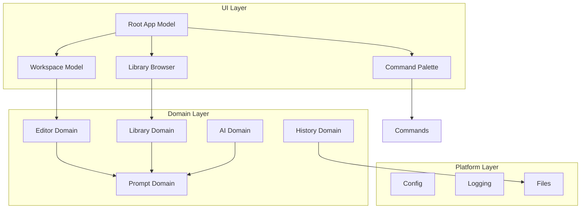

# Documentation Gap Analysis

**Date**: 2026-01-07  
**Status**: Comprehensive review completed

---

## Executive Summary

The fresh-build documentation is **comprehensive and well-structured** for the development process itself, with excellent coverage of milestones, architecture, coding standards, and testing patterns. However, there are **critical gaps** in supporting documentation that would be needed for actual implementation, onboarding, and deployment.

**Overall Assessment**: 7/10 - Strong process documentation, missing operational documentation

---

## Existing Documentation Assets

The fresh-build directory already contains excellent process documentation:

- [`milestones.md`](milestones.md:1) - 38 detailed milestones with test criteria
- [`project-structure.md`](project-structure.md:1) - Complete architecture and domain design
- [`go-style-guide.md`](go-style-guide.md:1) - Comprehensive coding standards
- [`go-testing-guide.md`](go-testing-guide.md:1) - Effect-based testing patterns
- [`milestone-execution-prompt.md`](milestone-execution-prompt.md:1) - AI-assisted development system
- [`HOW-TO-USE.md`](HOW-TO-USE.md:1) - Step-by-step execution guide
- [`README.md`](README.md:1) - System overview and quick start

This analysis focuses on **operational gaps** that would block actual implementation.

---

## Documentation Strengths

What's working well:

✅ **Excellent milestone breakdown** - 38 granular, testable milestones
✅ **Clear architecture** - Domain-driven design well documented
✅ **Comprehensive style guide** - Go coding standards are thorough
✅ **Strong testing guide** - Effect-based testing patterns are excellent
✅ **Good execution system** - Milestone execution prompt is well-designed
✅ **Progress tracking** - Clear system for tracking completion
✅ **Usage instructions** - HOW-TO-USE is clear and actionable
✅ **Theme system** - Well-documented theme system with examples

---

## Critical Gaps (Must Have)

These gaps would **block or significantly hinder** development and deployment.

### 1. Environment Setup Guide
**Priority**: 🔴 Critical
**Blocks**: Milestone 1 (Bootstrap & Config)
**Impact**: Cannot start development without this

**Missing**:
- Go version requirements
- Development environment setup (macOS, Linux, Windows)
- Required system tools and utilities
- IDE/editor setup recommendations
- Environment variable configuration
- First-time setup verification steps

**Recommended Document**: `docs/plans/fresh-build/SETUP.md`

**Should Include**:
```markdown
# Development Environment Setup

## Prerequisites
- Go 1.21+ (specific version)
- Git
- SQLite3 (for local testing)
- Terminal emulator with 256-color support

## Installation Steps
1. Install Go
2. Clone repository
3. Install dependencies
4. Verify setup

## IDE Configuration
- VS Code extensions
- Go tooling setup
- Debugging configuration

## Troubleshooting
- Common setup issues
- Platform-specific notes
```

---

### 2. Dependencies Documentation
**Priority**: 🔴 Critical
**Blocks**: Milestone 1 (Bootstrap & Config)
**Impact**: Cannot build or run without knowing dependencies

**Missing**:
- Complete list of Go modules with versions
- External library documentation links
- License information for dependencies
- Dependency update procedures
- Security considerations for external deps

**Recommended Document**: `docs/plans/fresh-build/DEPENDENCIES.md`

**Should Include**:
```markdown
# Dependencies

## Core Dependencies
- github.com/charmbracelet/bubbletea@v0.25.0
- github.com/charmbracelet/lipgloss@v0.10.0
- github.com/charmbracelet/glamour@v0.7.0
- modernc.org/sqlite@v1.28.0
- go.uber.org/zap@v1.26.0
- github.com/anthropics/anthropic-go-sdk@v0.1.0

## Development Dependencies
- github.com/stretchr/testify@v1.8.4
- github.com/golang/mock@v1.6.0

## Adding Dependencies
- How to add new dependencies
- Version pinning strategy
- Security scanning
```

---

### 3. Configuration Schema
**Priority**: 🔴 Critical
**Blocks**: Milestone 1 (Bootstrap & Config)
**Impact**: Cannot implement config system without schema

**Note**: While Milestone 1 will implement the config system, the schema should be documented **before** starting implementation to guide development.

**Missing**:
- Complete config.yaml schema
- All configuration options with defaults
- Validation rules
- Environment variable overrides
- Migration guide for config changes

**Recommended Document**: `docs/plans/fresh-build/CONFIG-SCHEMA.md`

**Should Include**:
```markdown
# Configuration Schema

## Config File Location
~/.promptstack/config.yaml

## Schema
```yaml
# API Configuration
api_key: string              # Claude API key (required)
model: string                # Model name (default: claude-3-sonnet)
max_retries: int             # Retry attempts (default: 3)
timeout: duration            # Request timeout (default: 30s)

# Editor Configuration
vim_mode: bool               # Enable vim mode (default: false)
auto_save_interval: duration # Auto-save interval (default: 1s)
undo_stack_size: int         # Undo history size (default: 100)

# Paths
data_dir: string             # Data directory (default: ~/.promptstack/data)
library_dir: string          # Library directory (default: ~/.promptstack/library)

# Logging
log_level: string            # debug|info|warn|error (default: info)
log_file: string            # Log file path (default: ~/.promptstack/debug.log)

# UI
theme: string                # Theme name (default: catppuccin-mocha)
```

## Validation Rules
- api_key: required, non-empty
- model: must be valid Claude model
- log_level: must be one of debug|info|warn|error
```

---

### 4. Database Schema Documentation
**Priority**: 🔴 Critical
**Blocks**: Milestone 15 (SQLite Setup)
**Impact**: Cannot implement history system without schema

**Missing**:
- Complete SQLite schema with DDL
- Table relationships and indexes
- FTS5 configuration details
- Migration strategy
- Query patterns and examples

**Recommended Document**: `docs/plans/fresh-build/DATABASE-SCHEMA.md`

**Should Include**:
```markdown
# Database Schema

## Database Location
~/.promptstack/data/history.db

## Tables

### compositions
```sql
CREATE TABLE compositions (
    id INTEGER PRIMARY KEY AUTOINCREMENT,
    uuid TEXT UNIQUE NOT NULL,
    content TEXT NOT NULL,
    created_at DATETIME DEFAULT CURRENT_TIMESTAMP,
    updated_at DATETIME DEFAULT CURRENT_TIMESTAMP,
    working_directory TEXT,
    prompt_count INTEGER DEFAULT 0,
    token_count INTEGER DEFAULT 0
);
```

### composition_tags
```sql
CREATE TABLE composition_tags (
    id INTEGER PRIMARY KEY AUTOINCREMENT,
    composition_id INTEGER NOT NULL,
    tag TEXT NOT NULL,
    FOREIGN KEY (composition_id) REFERENCES compositions(id) ON DELETE CASCADE
);
```

## Indexes
- idx_compositions_created_at
- idx_compositions_working_directory
- idx_composition_tags_tag

## FTS5 Configuration
```sql
CREATE VIRTUAL TABLE compositions_fts USING fts5(
    content,
    content=compositions,
    content_rowid=rowid
);
```

## Triggers
- Auto-update updated_at
- FTS5 sync triggers
```

---

### 5. Build and Deployment Guide
**Priority**: 🔴 Critical
**Blocks**: Milestone 6 (Auto-save) - basic app works
**Impact**: Cannot create distributable binaries

**Missing**:
- Build instructions for different platforms
- Cross-compilation steps
- Binary signing (if needed)
- Installation procedures
- Update mechanism

**Recommended Document**: `docs/plans/fresh-build/BUILD.md`

**Should Include**:
```markdown
# Build and Deployment

## Local Development Build
```bash
go build -o promptstack ./cmd/promptstack
```

## Production Builds

### macOS
```bash
GOOS=darwin GOARCH=amd64 go build -o promptstack-darwin-amd64 ./cmd/promptstack
GOOS=darwin GOARCH=arm64 go build -o promptstack-darwin-arm64 ./cmd/promptstack
```

### Linux
```bash
GOOS=linux GOARCH=amd64 go build -o promptstack-linux-amd64 ./cmd/promptstack
```

### Windows
```bash
GOOS=windows GOARCH=amd64 go build -o promptstack-windows-amd64.exe ./cmd/promptstack
```

## Installation
- Homebrew formula
- Linux packages
- Windows installer
- Manual installation

## Updates
- Version checking
- Auto-update mechanism
- Migration procedures
```

---

### 6. CI/CD Pipeline Documentation
**Priority**: 🔴 Critical
**Blocks**: Milestone 6 (Auto-save) - basic app works
**Impact**: Cannot automate testing and deployment

**Missing**:
- CI/CD configuration files
- Automated testing pipeline
- Release automation
- Code quality gates
- Deployment procedures

**Recommended Document**: `docs/plans/fresh-build/CICD.md`

**Should Include**:
```markdown
# CI/CD Pipeline

## GitHub Actions Workflow

### Test Workflow
- Run on every push/PR
- Run tests with race detector
- Check code coverage (>80%)
- Run linters (golangci-lint)
- Security scanning

### Release Workflow
- Trigger on tag
- Run full test suite
- Build binaries for all platforms
- Create GitHub release
- Update Homebrew formula

## Quality Gates
- All tests must pass
- Coverage >80%
- No linting errors
- No security vulnerabilities

## Local CI
```bash
make test-all
make lint
make coverage
```
```

---

## Important Gaps (Should Have)

These gaps would **significantly improve** development experience and maintainability.

### 7. Comprehensive Troubleshooting Guide
**Priority**: 🟡 Important  
**Impact**: Developers will waste time debugging common issues

**Current State**: Basic troubleshooting in [`HOW-TO-USE.md`](HOW-TO-USE.md:156)

**Missing**:
- Common error messages and solutions
- Platform-specific issues
- Performance troubleshooting
- Database corruption recovery
- API rate limit handling

**Recommended Document**: `docs/plans/fresh-build/TROUBLESHOOTING.md`

---

### 8. Contributing Guidelines
**Priority**: 🟡 Important  
**Impact**: Cannot accept contributions without clear guidelines

**Missing**:
- Contribution process
- Code review standards
- Pull request template
- Commit message conventions
- Issue reporting template

**Recommended Document**: `CONTRIBUTING.md` (root level)

---

### 9. Architecture Diagrams
**Priority**: 🟡 Important  
**Impact**: Hard to visualize system without diagrams

**Current State**: Text-based structure in [`project-structure.md`](project-structure.md:1)

**Missing**:
- High-level system architecture diagram
- Domain interaction diagram
- Data flow diagram
- Component relationship diagram
- Sequence diagrams for key workflows

**Recommended Document**: `docs/plans/fresh-build/ARCHITECTURE-DIAGRAMS.md`

**Should Include**:


---

### 10. Data Flow Documentation
**Priority**: 🟡 Important  
**Impact**: Hard to understand how data moves through system

**Missing**:
- Request/response flows
- Message passing in Bubble Tea
- State management patterns
- Event handling documentation
- Async operation flows

**Recommended Document**: `docs/plans/fresh-build/DATA-FLOW.md`

---

### 11. Keybindings Reference
**Priority**: 🟡 Important  
**Impact**: Users need comprehensive keybinding documentation

**Current State**: Scattered across milestones

**Missing**:
- Complete keybinding reference
- Default keybindings table
- Vim mode keybindings
- Custom keybinding configuration
- Keybinding conflicts resolution

**Recommended Document**: `docs/plans/fresh-build/KEYBINDINGS.md`

---

### 12. Migration Guide from Archive
**Priority**: 🟡 Important  
**Impact**: Users of old version need upgrade path

**Missing**:
- Data migration procedures
- Config migration
- Breaking changes documentation
- Rollback procedures
- Feature comparison

**Recommended Document**: `docs/plans/fresh-build/MIGRATION.md`

---

### 13. Testing Strategy Document
**Priority**: 🟡 Important  
**Impact**: Need overall testing philosophy beyond patterns

**Current State**: Testing patterns in [`go-testing-guide.md`](go-testing-guide.md:1)

**Missing**:
- Overall testing strategy
- Test pyramid implementation
- Coverage targets per package
- Integration test strategy
- E2E test approach
- Performance testing approach

**Recommended Document**: `docs/plans/fresh-build/TESTING-STRATEGY.md`

---

### 14. Performance Benchmarks and Targets
**Priority**: 🟡 Important  
**Impact**: Need performance goals to guide development

**Missing**:
- Performance targets for key operations
- Benchmark suite documentation
- Performance regression detection
- Memory usage targets
- Startup time targets

**Recommended Document**: `docs/plans/fresh-build/PERFORMANCE.md`

---

## Quick Wins (Can Be Created Now)

These documents can be created immediately without blocking development:

### 15. Contributing Guidelines
**Priority**: 🟢 Quick Win
**Impact**: Prepare for collaboration
**Estimated Time**: 30 minutes

**Recommended Document**: `CONTRIBUTING.md` (root level)

**Should Include**:
- Contribution process
- Code review standards
- Pull request template
- Commit message conventions
- Issue reporting template

---

### 16. Security Considerations
**Priority**: 🟢 Quick Win
**Impact**: Security awareness for developers
**Estimated Time**: 30 minutes

**Recommended Document**: `docs/plans/fresh-build/SECURITY.md`

**Should Include**:
- Security policy
- Vulnerability reporting
- API key handling
- Data privacy considerations

---

### 17. Bug Reporting Template
**Priority**: 🟢 Quick Win
**Impact**: Consistent bug reports
**Estimated Time**: 15 minutes

**Recommended Document**: `.github/ISSUE_TEMPLATE/bug_report.md`

---

### 18. Feature Request Template
**Priority**: 🟢 Quick Win
**Impact**: Clear process for proposing features
**Estimated Time**: 15 minutes

**Recommended Document**: `.github/ISSUE_TEMPLATE/feature_request.md`

---

### 19. Release Notes Template
**Priority**: 🟢 Quick Win
**Impact**: Consistent release documentation
**Estimated Time**: 15 minutes

**Recommended Document**: `docs/plans/fresh-build/RELEASE-NOTES-TEMPLATE.md`

**Total Quick Wins Time**: ~2 hours

---

## Nice to Have (Would Improve)

These gaps would **enhance** the documentation but aren't critical.

### 20. API Reference (Internal)
**Priority**: 🟢 Nice to Have
**Impact**: Easier to understand internal APIs

**Recommended Document**: `docs/plans/fresh-build/API-REFERENCE.md`

---

### 21. User Guide
**Priority**: 🟢 Nice to Have
**Impact**: End-user documentation

**Recommended Document**: `docs/USER-GUIDE.md` (root level)

---

## Documentation Generated During Development

The milestone execution system will automatically create:
- Task lists per milestone (M1-task-list.md, etc.)
- Reference documents (M1-reference.md, etc.)
- Testing guides (M1-testing-guide.md, etc.)
- Checkpoint documents (task-level completion records)
- Milestone summaries (M1-summary.md, etc.)

These provide **implementation-level documentation** that complements the strategic documentation identified in this analysis.

---

## Documentation Completeness Tracking

| Phase | Documents | Status | Completion |
|-------|-----------|--------|------------|
| Pre-Development | 3 critical docs | ⏳ Not Started | 0% |
| Foundation | 3 important docs | ⏳ Not Started | 0% |
| Integration | 3 important docs | ⏳ Not Started | 0% |
| Polish | 3 nice-to-have docs | ⏳ Not Started | 0% |
| **Total** | **12 priority docs** | ⏳ **Not Started** | **0%** |

Update this table as documentation is created.

---

## Recommendations

### Phase 0: Pre-Development (Do Before Milestone 1)
**Timeline**: 1-2 days
**Blockers**: These must exist before starting Milestone 1

1. ✅ **Environment Setup Guide** (SETUP.md)
   - Go version, tools, IDE setup
   - Platform-specific instructions
   - Verification steps

2. ✅ **Dependencies Documentation** (DEPENDENCIES.md)
   - List all planned dependencies with versions
   - Rationale for each choice
   - License compatibility check

3. ✅ **Configuration Schema** (CONFIG-SCHEMA.md)
   - Complete YAML schema with all fields
   - Validation rules
   - Default values
   - Environment variable overrides

### Phase 1: Foundation Phase (During Milestones 1-6)
**Timeline**: Parallel with development

4. **Database Schema** (DATABASE-SCHEMA.md) - Before Milestone 15
5. **Build Guide** (BUILD.md) - After Milestone 6 (basic app works)
6. **CI/CD Documentation** (CICD.md) - After Milestone 6

### Phase 2: Integration Phase (During Milestones 7-26)
**Timeline**: As features are completed

7. **Troubleshooting Guide** - Accumulate common issues
8. **Keybindings Reference** - Document as implemented
9. **Architecture Diagrams** - Create after core domains stable

### Phase 3: Polish Phase (During Milestones 27-38)
**Timeline**: Prepare for release

10. **User Guide** - Complete end-user documentation
11. **Migration Guide** - If upgrading from archive
12. **Contributing Guidelines** - Prepare for open source
13. **Testing Strategy** - Beyond patterns
14. **Performance Targets** - Guide optimization

### Quick Wins (Can Be Done Anytime)
**Estimated Time**: 2 hours total

15. **Security Documentation** - Security policy and considerations
16. **Bug/Feature Templates** - GitHub issue templates
17. **Release Notes Template** - Standard format

---

## Recommended Implementation Order

**Week 1 (Before Development Starts)**
1. SETUP.md
2. DEPENDENCIES.md
3. CONFIG-SCHEMA.md

**Week 2-3 (Milestones 1-6)**
4. DATABASE-SCHEMA.md (before M15)
5. BUILD.md
6. CICD.md

**Week 4-8 (Milestones 7-26)**
7. TROUBLESHOOTING.md (ongoing)
8. KEYBINDINGS.md
9. ARCHITECTURE-DIAGRAMS.md

**Week 9-12 (Milestones 27-38)**
10. TESTING-STRATEGY.md
11. PERFORMANCE.md
12. MIGRATION.md
13. USER-GUIDE.md
14. CONTRIBUTING.md
15. SECURITY.md

**Anytime (Quick Wins)**
16. Bug/Feature Templates
17. Release Notes Template

---

## Documentation Quality Metrics

| Category | Score | Notes |
|----------|-------|-------|
| Process Documentation | 9/10 | Excellent milestone and execution docs |
| Architecture Documentation | 8/10 | Good structure, needs diagrams |
| Code Quality Documentation | 9/10 | Excellent style and testing guides |
| Operational Documentation | 3/10 | Missing setup, build, deployment |
| User Documentation | 4/10 | Basic usage, needs comprehensive guide |
| Developer Onboarding | 5/10 | Good process, missing environment setup |
| **Overall** | **7/10** | Strong foundation, missing operational docs |

---

## Conclusion

The fresh-build documentation has an **excellent foundation** for the development process itself. The milestone breakdown, architecture, style guide, and testing guide are all comprehensive and well-written. However, the documentation is **missing critical operational documentation** that would be needed to actually start development, build the application, and deploy it.

**Key Insight**: The documentation assumes you already have a working Go development environment and understand how to build/deploy Go applications. For a complete, self-contained project, you need to add the operational documentation.

**Next Steps**:
1. Create the 3 Phase 0 documents (Setup, Dependencies, Config Schema) before starting Milestone 1
2. Create Phase 1 documents during Milestones 1-6
3. Create Phase 2 documents as features are implemented
4. Create Phase 3 documents during final polish

**Implementation Order**: Follow the recommended implementation order above for a systematic approach to documentation creation.

---

**Last Updated**: 2026-01-07  
**Reviewed By**: Architect Mode  
**Status**: Ready for review and action