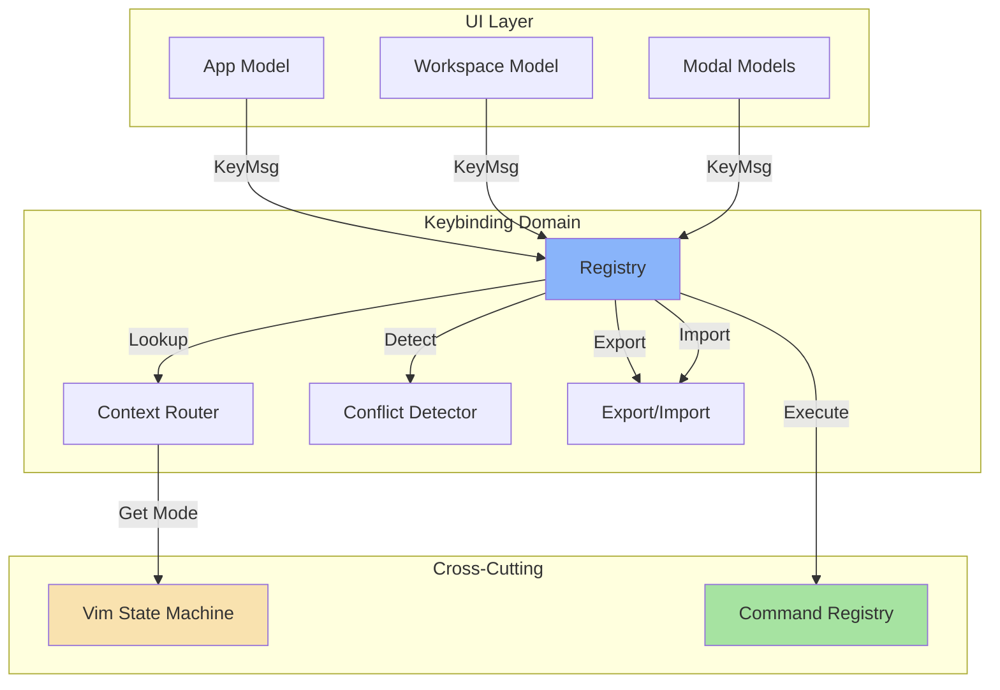

# Keybinding Management System

## Executive Summary

This document defines the architecture and implementation strategy for a centralized keybinding management system in PromptStack. The system provides a declarative, context-aware keybinding registry that integrates seamlessly with Bubble Tea's event model and the existing vim state machine.

**Status**: Proposed - Ready for review and implementation

---

## Table of Contents

1. [Domain Placement](#domain-placement)
2. [Architecture Overview](#architecture-overview)
3. [Core Concepts](#core-concepts)
4. [API Design](#api-design)
5. [Integration Strategy](#integration-strategy)
6. [Implementation Phases](#implementation-phases)
7. [Testing Strategy](#testing-strategy)
8. [Migration Plan](#migration-plan)
9. [Future Enhancements](#future-enhancements)

---

## Domain Placement

### Decision: Dedicated Keybinding Domain

**Location**: `internal/keybindings/`

**Rationale**:

1. **Cross-Cutting Concern**: Keybinding management affects multiple domains (UI, vim, commands) but doesn't belong to any single one
2. **Business Logic**: Contains application-specific rules about keybinding behavior, not generic infrastructure
3. **Similar to Commands**: Like [`internal/commands/`](archive/code/internal/commands/), it's a system that manages application behavior
4. **Independent Evolution**: Keybinding system can evolve independently of UI, vim, or other domains
5. **Clear Boundaries**: Has well-defined interfaces and responsibilities

### Domain Responsibilities

The **Keybinding Domain** is responsible for:

- **Keybinding Registration**: Declarative registration of keybindings with metadata
- **Context-Aware Routing**: Lookup keybindings based on current context and mode
- **Conflict Detection**: Identify and report conflicting keybindings
- **Vim Mode Integration**: Coordinate with vim state machine for mode-specific bindings
- **User Customization**: Support export/import of user-defined keybindings
- **Documentation Generation**: Auto-generate keybinding reference documentation

### Domain Dependencies

```
internal/keybindings/
    ↓ depends on
internal/vim/          (for vim mode integration)
internal/commands/       (for command execution)
internal/platform/errors/ (for error handling)
    ↑ used by
ui/                    (all UI components)
```

**Dependency Rules**:
- ✅ Keybindings can import vim, commands, platform
- ✅ UI can import keybindings
- ❌ Keybindings should NOT import UI packages
- ❌ Keybindings should NOT import business logic domains (editor, prompt, etc.)

---

## Architecture Overview

### System Diagram



### Key Components

#### 1. Registry (`registry.go`)

Central store for all keybindings with metadata.

**Responsibilities**:
- Store keybindings with context and mode information
- Provide lookup by key, context, and mode
- Support registration and deregistration
- Maintain keybinding metadata (description, category, etc.)

**Key Types**:
```go
type Key struct {
    Type  tea.KeyType
    Alt   bool
    Ctrl  bool
    Runes []rune
}

type Action struct {
    ID          string
    Description string
    Category    string
    Handler     func() tea.Cmd
    Context     string
    Mode        string
    Priority    int
}

type Registry struct {
    bindings map[Key]Action
    contexts map[string]map[Key]Action
    modes    map[string]map[Key]Action
}
```

#### 2. Context Router (`router.go`)

Intelligent keybinding lookup based on current context and mode.

**Responsibilities**:
- Determine active context (global, workspace, modal, etc.)
- Query vim state machine for current mode
- Apply priority-based conflict resolution
- Return appropriate action or nil

**Key Functions**:
```go
func (r *Router) Lookup(key Key, context string, vimMode *vim.State) (Action, bool)
func (r *Router) SetActiveContext(context string)
func (r *Router) GetActiveContext() string
```

#### 3. Conflict Detector (`conflict.go`)

Detect and report keybinding conflicts.

**Responsibilities**:
- Scan registry for duplicate keybindings
- Report conflicts with context and mode information
- Provide suggestions for conflict resolution

**Key Functions**:
```go
func (d *Detector) DetectConflicts(registry *Registry) []Conflict
type Conflict struct {
    Key      Key
    Actions  []Action
    Severity ConflictSeverity
}
```

#### 4. Export/Import (`customization.go`)

Support user customization through export/import.

**Responsibilities**:
- Export keybindings to user-editable format (YAML/JSON)
- Import user-defined keybindings
- Validate imported keybindings
- Merge with default keybindings

**Key Functions**:
```go
func (e *Exporter) Export(registry *Registry) ([]byte, error)
func (i *Importer) Import(data []byte, registry *Registry) error
```

---

## Core Concepts

### 1. Key Representation

Keys are represented as a struct that captures all modifiers and character data:

```go
type Key struct {
    Type  tea.KeyType  // tea.KeyUp, tea.KeyRunes, etc.
    Alt   bool          // Alt modifier
    Ctrl  bool          // Ctrl modifier
    Runes []rune       // Character data for KeyRunes
}
```

**Examples**:
```go
// Ctrl+C
Key{Type: tea.KeyCtrlC}

// 'j' character
Key{Type: tea.KeyRunes, Runes: []rune{'j'}}

// Alt+Left
Key{Type: tea.KeyAltLeft}

// Ctrl+Space
Key{Type: tea.KeyCtrlSpace}
```

### 2. Context System

Contexts define where keybindings apply:

| Context | Description | Example Keybindings |
|---------|-------------|-------------------|
| `global` | Application-wide, always active | Ctrl+C (quit), Ctrl+P (palette) |
| `workspace` | Primary editing screen | Arrow keys, Ctrl+Z/Y (undo/redo) |
| `modal` | Any modal overlay | Esc (close), Enter (select) |
| `palette` | Command palette modal | Arrow keys, Enter (execute) |
| `browser` | Library browser modal | Arrow keys, Enter (insert) |
| `history` | History browser modal | Arrow keys, Delete (remove) |

**Context Hierarchy**:
```
global (highest priority)
  ↓
modal (if active)
  ↓
{specific modal} (palette, browser, history, etc.)
  ↓
workspace (lowest priority)
```

### 3. Vim Mode Integration

Keybindings respect vim mode state:

| Vim Mode | Description | Example Keybindings |
|----------|-------------|-------------------|
| `normal` | Navigation and commands | h/j/k/l (move), u (undo), dd (delete line) |
| `insert` | Text editing | All characters, Backspace, Enter |
| `visual` | Text selection | v (start visual), y (yank), d (delete) |

**Integration Pattern**:
```go
// In UI component Update()
func (m Model) Update(msg tea.Msg) (tea.Model, tea.Cmd) {
    switch msg := msg.(type) {
    case tea.KeyMsg:
        key := keybindings.FromKeyMsg(msg)
        action, found := registry.Lookup(
            key,
            m.context,
            m.vimState,
        )
        if found {
            return m, action.Handler()
        }
    }
}
```

### 4. Priority System

When multiple keybindings match, priority determines winner:

```go
type Action struct {
    Priority int  // Higher = more important
    // ... other fields
}
```

**Priority Rules**:
1. **Context priority**: Global > Modal > Specific Modal > Workspace
2. **Mode priority**: Specific mode > Any mode
3. **Explicit priority**: User-defined > Default
4. **Registration order**: Later registrations override earlier ones

### 5. Conflict Detection

Conflicts occur when same key has multiple actions in same context/mode:

```go
type Conflict struct {
    Key      Key
    Actions  []Action  // Conflicting actions
    Severity ConflictSeverity
}

type ConflictSeverity int

const (
    SeverityWarning ConflictSeverity = iota  // Same key, different modes
    SeverityError                       // Same key, same mode
)
```

**Example Conflict**:
```go
// Conflict: 'j' bound to both move_down and join_lines
Conflict{
    Key: Key{Type: tea.KeyRunes, Runes: []rune{'j'}},
    Actions: []Action{
        {ID: "move_down", Mode: "normal"},
        {ID: "join_lines", Mode: "normal"},
    },
    Severity: SeverityError,
}
```

---

## API Design

### Registry API

#### Registration

```go
// Register adds a keybinding to the registry
func (r *Registry) Register(key Key, action Action) error

// RegisterContext adds keybindings for a specific context
func (r *Registry) RegisterContext(context string, bindings map[Key]Action) error

// RegisterMode adds keybindings for a specific vim mode
func (r *Registry) RegisterMode(mode string, bindings map[Key]Action) error
```

**Usage Example**:
```go
registry := keybindings.NewRegistry()

// Register global keybinding
registry.Register(
    keybindings.Key{Type: tea.KeyCtrlC},
    keybindings.Action{
        ID:          "quit",
        Description:  "Quit application",
        Category:    "global",
        Handler:     func() tea.Cmd { return tea.Quit },
        Context:     "global",
        Priority:    100,
    },
)

// Register workspace keybinding
registry.Register(
    keybindings.Key{Type: tea.KeyRunes, Runes: []rune{'j'}},
    keybindings.Action{
        ID:          "move_down",
        Description:  "Move cursor down",
        Category:    "navigation",
        Handler:     func() tea.Cmd { return MoveCursorDownMsg{} },
        Context:     "workspace",
        Mode:        "normal",
        Priority:    50,
    },
)
```

#### Lookup

```go
// Lookup finds an action for a key in the given context and mode
func (r *Registry) Lookup(key Key, context string, vimMode *vim.State) (Action, bool)

// LookupContext finds an action for a key in a specific context
func (r *Registry) LookupContext(key Key, context string) (Action, bool)

// LookupMode finds an action for a key in a specific vim mode
func (r *Registry) LookupMode(key Key, mode string) (Action, bool)
```

**Usage Example**:
```go
// In UI component Update()
func (m Model) Update(msg tea.Msg) (tea.Model, tea.Cmd) {
    switch msg := msg.(type) {
    case tea.KeyMsg:
        key := keybindings.FromKeyMsg(msg)
        action, found := m.registry.Lookup(
            key,
            m.context,
            m.vimState,
        )
        if found {
            return m, action.Handler()
        }
    }
}
```

#### Query

```go
// List returns all keybindings
func (r *Registry) List() []Binding

// ListContext returns keybindings for a specific context
func (r *Registry) ListContext(context string) []Binding

// ListMode returns keybindings for a specific vim mode
func (r *Registry) ListMode(mode string) []Binding

// FindByID finds a keybinding by its ID
func (r *Registry) FindByID(id string) (Binding, bool)
```

**Usage Example**:
```go
// Get all workspace keybindings
workspaceBindings := registry.ListContext("workspace")

// Get all normal mode keybindings
normalBindings := registry.ListMode("normal")

// Find specific keybinding
if binding, found := registry.FindByID("move_down"); found {
    fmt.Printf("Key: %v, Description: %s", binding.Key, binding.Description)
}
```

#### Conflict Detection

```go
// DetectConflicts finds all keybinding conflicts
func (r *Registry) DetectConflicts() []Conflict

// Validate checks if a new keybinding would cause conflicts
func (r *Registry) Validate(key Key, action Action) []Conflict
```

**Usage Example**:
```go
// Check for conflicts before registering
conflicts := registry.Validate(key, action)
if len(conflicts) > 0 {
    for _, conflict := range conflicts {
        fmt.Printf("Conflict: %v\n", conflict)
    }
    return errors.New("keybinding conflicts detected")
}

// Detect all conflicts in registry
allConflicts := registry.DetectConflicts()
for _, conflict := range allConflicts {
    if conflict.Severity == SeverityError {
        log.Error("Keybinding conflict", "key", conflict.Key, "actions", conflict.Actions)
    }
}
```

### Router API

```go
// Router manages context-aware keybinding lookup
type Router struct {
    registry *Registry
    activeContext string
}

// NewRouter creates a new router
func NewRouter(registry *Registry) *Router

// SetActiveContext sets the current active context
func (r *Router) SetActiveContext(context string)

// GetActiveContext returns the current active context
func (r *Router) GetActiveContext() string

// Lookup finds an action for a key considering context and vim mode
func (r *Router) Lookup(key Key, vimMode *vim.State) (Action, bool)
```

**Usage Example**:
```go
// Initialize router
router := keybindings.NewRouter(registry)

// Set context when switching screens
router.SetActiveContext("workspace")

// In Update()
func (m Model) Update(msg tea.Msg) (tea.Model, tea.Cmd) {
    switch msg := msg.(type) {
    case tea.KeyMsg:
        key := keybindings.FromKeyMsg(msg)
        action, found := router.Lookup(key, m.vimState)
        if found {
            return m, action.Handler()
        }
    }
}
```

### Export/Import API

```go
// Exporter handles keybinding export
type Exporter struct {
    format string  // "yaml", "json"
}

// Export exports keybindings to user-editable format
func (e *Exporter) Export(registry *Registry) ([]byte, error)

// Importer handles keybinding import
type Importer struct {
    format string  // "yaml", "json"
}

// Import imports user-defined keybindings
func (i *Importer) Import(data []byte, registry *Registry) error

// Validate checks if imported keybindings are valid
func (i *Importer) Validate(data []byte) ([]Conflict, error)
```

**Usage Example**:
```go
// Export keybindings
exporter := keybindings.NewExporter("yaml")
data, err := exporter.Export(registry)
if err != nil {
    return err
}
err = os.WriteFile("keybindings.yaml", data, 0644)

// Import keybindings
importer := keybindings.NewImporter("yaml")
data, err = os.ReadFile("keybindings.yaml")
if err != nil {
    return err
}
err = importer.Import(data, registry)
```

---

## Integration Strategy

### 1. UI Component Integration

Each UI component integrates with keybinding system:

```go
// ui/workspace/model.go
package workspace

import (
    tea "github.com/charmbracelet/bubbletea"
    "github.com/kyledavis/promptstack/internal/keybindings"
    "github.com/kyledavis/promptstack/internal/vim"
)

type Model struct {
    registry *keybindings.Registry
    router   *keybindings.Router
    vimState *vim.State
    // ... other fields
}

func New(registry *keybindings.Registry, vimState *vim.State) Model {
    router := keybindings.NewRouter(registry)
    router.SetActiveContext("workspace")
    
    return Model{
        registry: registry,
        router:   router,
        vimState: vimState,
    }
}

func (m Model) Update(msg tea.Msg) (tea.Model, tea.Cmd) {
    switch msg := msg.(type) {
    case tea.KeyMsg:
        key := keybindings.FromKeyMsg(msg)
        action, found := m.router.Lookup(key, m.vimState)
        if found {
            return m, action.Handler()
        }
    }
    // ... rest of update logic
}
```

### 2. App-Level Integration

Root app model manages global keybindings:

```go
// ui/app/model.go
package app

import (
    tea "github.com/charmbracelet/bubbletea"
    "github.com/kyledavis/promptstack/internal/keybindings"
    "github.com/kyledavis/promptstack/internal/vim"
)

type Model struct {
    registry *keybindings.Registry
    router   *keybindings.Router
    vimState *vim.State
    // ... other fields
}

func New() Model {
    registry := keybindings.NewRegistry()
    vimState := vim.NewState()
    router := keybindings.NewRouter(registry)
    router.SetActiveContext("global")
    
    // Register global keybindings
    registerGlobalKeybindings(registry)
    
    return Model{
        registry: registry,
        router:   router,
        vimState: vimState,
    }
}

func (m Model) Update(msg tea.Msg) (tea.Model, tea.Cmd) {
    switch msg := msg.(type) {
    case tea.KeyMsg:
        key := keybindings.FromKeyMsg(msg)
        action, found := m.router.Lookup(key, m.vimState)
        if found {
            return m, action.Handler()
        }
    }
    // ... rest of update logic
}

func registerGlobalKeybindings(registry *keybindings.Registry) {
    registry.Register(
        keybindings.Key{Type: tea.KeyCtrlC},
        keybindings.Action{
            ID:          "quit",
            Description:  "Quit application",
            Category:    "global",
            Handler:     func() tea.Cmd { return tea.Quit },
            Context:     "global",
            Priority:    100,
        },
    )
    // ... more global keybindings
}
```

### 3. Vim Mode Integration

Keybinding system coordinates with vim state machine:

```go
// In router.Lookup()
func (r *Router) Lookup(key Key, vimMode *vim.State) (Action, bool) {
    // Get current vim mode
    mode := vimMode.CurrentMode.String()
    
    // Try mode-specific lookup first
    if action, found := r.registry.LookupMode(key, mode); found {
        return action, true
    }
    
    // Fall back to context lookup
    return r.registry.LookupContext(key, r.activeContext)
}
```

### 4. Command System Integration

Keybindings execute commands through command registry:

```go
// Register keybinding that executes command
registry.Register(
    keybindings.Key{Type: tea.KeyCtrlP},
    keybindings.Action{
        ID:          "show_palette",
        Description:  "Show command palette",
        Category:    "global",
        Handler: func() tea.Cmd {
            return func() tea.Msg {
                return ShowPaletteMsg{}
            }
        },
        Context:     "global",
        Priority:    90,
    },
)
```

---

## Implementation Phases

### Phase 1: Core Registry (2-3 days)

**Goal**: Implement basic keybinding storage and lookup

**Tasks**:
- [ ] Create `internal/keybindings/` package
- [ ] Implement `Key` type with `FromKeyMsg()` helper
- [ ] Implement `Action` type
- [ ] Implement `Registry` struct
- [ ] Implement `Register()` method
- [ ] Implement `Lookup()` method
- [ ] Implement `List()` method
- [ ] Write unit tests for registry

**Deliverables**:
- `internal/keybindings/key.go`
- `internal/keybindings/action.go`
- `internal/keybindings/registry.go`
- `internal/keybindings/registry_test.go`

### Phase 2: Context-Aware Routing (2-3 days)

**Goal**: Implement intelligent keybinding lookup

**Tasks**:
- [ ] Implement `Router` struct
- [ ] Implement `SetActiveContext()` method
- [ ] Implement `Lookup()` with context and mode support
- [ ] Implement priority-based conflict resolution
- [ ] Write unit tests for router

**Deliverables**:
- `internal/keybindings/router.go`
- `internal/keybindings/router_test.go`

### Phase 3: Conflict Detection (1-2 days)

**Goal**: Detect and report keybinding conflicts

**Tasks**:
- [ ] Implement `Conflict` type
- [ ] Implement `ConflictSeverity` enum
- [ ] Implement `DetectConflicts()` method
- [ ] Implement `Validate()` method
- [ ] Write unit tests for conflict detection

**Deliverables**:
- `internal/keybindings/conflict.go`
- `internal/keybindings/conflict_test.go`

### Phase 4: UI Integration (3-4 days)

**Goal**: Integrate keybinding system with UI components

**Tasks**:
- [ ] Update `ui/app/model.go` to use registry
- [ ] Update `ui/workspace/model.go` to use registry
- [ ] Update modal components to use registry
- [ ] Remove old switch statement keybinding code
- [ ] Write integration tests

**Deliverables**:
- Updated UI components
- Integration tests

### Phase 5: User Customization (2-3 days)

**Goal**: Support export/import of user keybindings

**Tasks**:
- [ ] Implement `Exporter` struct
- [ ] Implement `Importer` struct
- [ ] Implement YAML export/import
- [ ] Implement JSON export/import
- [ ] Add validation for imported keybindings
- [ ] Write unit tests

**Deliverables**:
- `internal/keybindings/export.go`
- `internal/keybindings/import.go`
- `internal/keybindings/customization_test.go`

### Phase 6: Documentation Generation (1-2 days)

**Goal**: Auto-generate keybinding documentation

**Tasks**:
- [ ] Implement documentation generator
- [ ] Generate markdown reference
- [ ] Generate table format
- [ ] Add to build process

**Deliverables**:
- `internal/keybindings/docs.go`
- Auto-generated documentation

### Phase 7: Migration (2-3 days)

**Goal**: Migrate all existing keybindings to new system

**Tasks**:
- [ ] Create migration script
- [ ] Migrate global keybindings
- [ ] Migrate workspace keybindings
- [ ] Migrate modal keybindings
- [ ] Test all keybindings
- [ ] Update user documentation

**Deliverables**:
- Migration script
- Updated documentation

**Total Estimated Time**: 13-18 days

---

## Testing Strategy

### Unit Tests

**Registry Tests** (`registry_test.go`):
```go
func TestRegistry_Register(t *testing.T) {
    registry := keybindings.NewRegistry()
    
    key := keybindings.Key{Type: tea.KeyCtrlC}
    action := keybindings.Action{
        ID:      "quit",
        Handler: func() tea.Cmd { return tea.Quit },
    }
    
    err := registry.Register(key, action)
    assert.NoError(t, err)
    
    foundAction, found := registry.Lookup(key, "global", nil)
    assert.True(t, found)
    assert.Equal(t, "quit", foundAction.ID)
}

func TestRegistry_ConflictDetection(t *testing.T) {
    registry := keybindings.NewRegistry()
    
    key := keybindings.Key{Type: tea.KeyRunes, Runes: []rune{'j'}}
    
    // Register first action
    registry.Register(key, keybindings.Action{ID: "move_down"})
    
    // Register conflicting action
    err := registry.Register(key, keybindings.Action{ID: "join_lines"})
    assert.Error(t, err)
    
    conflicts := registry.DetectConflicts()
    assert.Len(t, conflicts, 1)
}
```

**Router Tests** (`router_test.go`):
```go
func TestRouter_ContextPriority(t *testing.T) {
    registry := keybindings.NewRegistry()
    router := keybindings.NewRouter(registry)
    
    // Register global keybinding
    registry.Register(
        keybindings.Key{Type: tea.KeyCtrlC},
        keybindings.Action{ID: "global_quit", Context: "global"},
    )
    
    // Register workspace keybinding
    registry.Register(
        keybindings.Key{Type: tea.KeyCtrlC},
        keybindings.Action{ID: "workspace_quit", Context: "workspace"},
    )
    
    // Set workspace context
    router.SetActiveContext("workspace")
    
    // Lookup should return workspace action (higher priority)
    action, found := router.Lookup(
        keybindings.Key{Type: tea.KeyCtrlC},
        nil,
    )
    assert.True(t, found)
    assert.Equal(t, "workspace_quit", action.ID)
}

func TestRouter_VimModeIntegration(t *testing.T) {
    registry := keybindings.NewRegistry()
    router := keybindings.NewRouter(registry)
    vimState := vim.NewState()
    
    // Register normal mode keybinding
    registry.Register(
        keybindings.Key{Type: tea.KeyRunes, Runes: []rune{'j'}},
        keybindings.Action{ID: "move_down", Mode: "normal"},
    )
    
    // Set normal mode
    vimState.SetMode(vim.NormalMode)
    
    // Lookup should return normal mode action
    action, found := router.Lookup(
        keybindings.Key{Type: tea.KeyRunes, Runes: []rune{'j'}},
        vimState,
    )
    assert.True(t, found)
    assert.Equal(t, "move_down", action.ID)
}
```

### Integration Tests

**UI Integration Tests** (`test/integration/keybinding_test.go`):
```go
func TestKeybindingIntegration(t *testing.T) {
    // Setup
    registry := keybindings.NewRegistry()
    vimState := vim.NewState()
    app := ui.NewApp(registry, vimState)
    
    // Test global keybinding
    model, cmd := app.Update(tea.KeyMsg{Type: tea.KeyCtrlC})
    assert.NotNil(t, cmd)
    
    // Test workspace keybinding
    app.SetActiveScreen("workspace")
    model, cmd = app.Update(tea.KeyMsg{Type: tea.KeyRunes, Runes: []rune{'j'}})
    assert.NotNil(t, cmd)
    
    // Test vim mode keybinding
    vimState.SetMode(vim.NormalMode)
    model, cmd = app.Update(tea.KeyMsg{Type: tea.KeyRunes, Runes: []rune{'j'}})
    assert.NotNil(t, cmd)
}
```

### Manual Testing Checklist

- [ ] All global keybindings work
- [ ] All workspace keybindings work
- [ ] All modal keybindings work
- [ ] Vim mode keybindings work in normal mode
- [ ] Vim mode keybindings work in insert mode
- [ ] Vim mode keybindings work in visual mode
- [ ] Context switching works correctly
- [ ] Priority system resolves conflicts correctly
- [ ] User customization export works
- [ ] User customization import works
- [ ] Conflict detection reports all conflicts
- [ ] Documentation is accurate

---

## Migration Plan

### Migration Strategy

**Approach**: Gradual migration with parallel operation

**Rationale**:
- Minimize risk by keeping old system functional
- Test new system incrementally
- Easy rollback if issues arise

### Migration Steps

#### Step 1: Setup (Day 1)

- [ ] Create `internal/keybindings/` package
- [ ] Implement Phase 1 (Core Registry)
- [ ] Write unit tests
- [ ] Verify tests pass

#### Step 2: Parallel Operation (Days 2-5)

- [ ] Keep old keybinding code functional
- [ ] Implement Phase 2-3 (Router, Conflict Detection)
- [ ] Create migration script to register all existing keybindings
- [ ] Run migration script
- [ ] Verify new registry has all keybindings

#### Step 3: Gradual UI Migration (Days 6-10)

- [ ] Update `ui/app/model.go` to use new system
- [ ] Test global keybindings
- [ ] Update `ui/workspace/model.go` to use new system
- [ ] Test workspace keybindings
- [ ] Update modal components one by one
- [ ] Test each modal after update

#### Step 4: Cleanup (Days 11-12)

- [ ] Remove old switch statement code
- [ ] Remove unused keybinding constants
- [ ] Update documentation
- [ ] Run full test suite
- [ ] Manual testing

#### Step 5: Advanced Features (Days 13-18)

- [ ] Implement Phase 5 (User Customization)
- [ ] Implement Phase 6 (Documentation Generation)
- [ ] Test export/import
- [ ] Verify documentation accuracy
- [ ] Update user documentation

### Migration Script

```go
// cmd/migrate-keybindings/main.go
package main

import (
    "github.com/kyledavis/promptstack/internal/keybindings"
    "github.com/kyledavis/promptstack/internal/vim"
)

func main() {
    registry := keybindings.NewRegistry()
    
    // Migrate global keybindings
    migrateGlobalKeybindings(registry)
    
    // Migrate workspace keybindings
    migrateWorkspaceKeybindings(registry)
    
    // Migrate modal keybindings
    migrateModalKeybindings(registry)
    
    // Detect conflicts
    conflicts := registry.DetectConflicts()
    if len(conflicts) > 0 {
        for _, conflict := range conflicts {
            fmt.Printf("Conflict: %v\n", conflict)
        }
    }
    
    fmt.Println("Migration complete!")
}

func migrateGlobalKeybindings(registry *keybindings.Registry) {
    registry.Register(
        keybindings.Key{Type: tea.KeyCtrlC},
        keybindings.Action{
            ID:          "quit",
            Description:  "Quit application",
            Category:    "global",
            Handler:     func() tea.Cmd { return tea.Quit },
            Context:     "global",
            Priority:    100,
        },
    )
    // ... more global keybindings
}
```

---

## Future Enhancements

### 1. Keybinding Profiles

Support multiple keybinding profiles:

```go
type Profile struct {
    Name        string
    Description string
    Bindings    map[Key]Action
}

func (r *Registry) LoadProfile(profile Profile) error
func (r *Registry) SaveProfile(name string) (Profile, error)
```

**Use Cases**:
- Vim user profile
- Emacs user profile
- Custom user profile

### 2. Keybinding Recording

Record keybindings interactively:

```go
func (r *Registry) StartRecording() error
func (r *Registry) StopRecording() (Key, error)
```

**Use Cases**:
- User creates custom keybinding
- User records complex key sequence
- Accessibility: Record preferred keybindings

### 3. Keybinding Suggestions

Suggest keybindings based on context:

```go
func (r *Registry) Suggest(context string, mode string) []Action
```

**Use Cases**:
- Help system shows available keybindings
- Context-aware suggestions
- Learning tool for new users

### 4. Keybinding Validation

Validate keybindings against best practices:

```go
func (r *Registry) ValidateBestPractices() []ValidationIssue
```

**Use Cases**:
- Warn about non-standard keybindings
- Suggest improvements
- Ensure accessibility

### 5. Keybinding Analytics

Track keybinding usage:

```go
type UsageStats struct {
    Key      Key
    ActionID string
    Count    int
    LastUsed time.Time
}

func (r *Registry) RecordUsage(key Key, actionID string)
func (r *Registry) GetUsageStats() []UsageStats
```

**Use Cases**:
- Identify unused keybindings
- Optimize default keybindings
- User behavior analysis

---

## Appendix

### A. Keybinding Reference

#### Global Keybindings

| Key | Action | Description |
|-----|---------|-------------|
| Ctrl+C | quit | Quit application |
| Ctrl+P | show_palette | Show command palette |
| Ctrl+B | show_browser | Show library browser |
| Ctrl+H | show_history | Show history browser |

#### Workspace Keybindings

| Key | Mode | Action | Description |
|-----|-------|---------|-------------|
| Arrow Up | - | move_up | Move cursor up |
| Arrow Down | - | move_down | Move cursor down |
| Arrow Left | - | move_left | Move cursor left |
| Arrow Right | - | move_right | Move cursor right |
| Ctrl+Z | - | undo | Undo last action |
| Ctrl+Y | - | redo | Redo last action |
| Tab | - | next_placeholder | Navigate to next placeholder |
| Shift+Tab | - | prev_placeholder | Navigate to previous placeholder |
| j | normal | move_down | Move cursor down (vim) |
| k | normal | move_up | Move cursor up (vim) |
| h | normal | move_left | Move cursor left (vim) |
| l | normal | move_right | Move cursor right (vim) |
| u | normal | undo | Undo last action (vim) |
| i | normal | enter_insert | Enter insert mode (vim) |
| Esc | insert | enter_normal | Enter normal mode (vim) |

#### Modal Keybindings

| Key | Action | Description |
|-----|---------|-------------|
| Esc | close | Close modal |
| Enter | select | Select item / Execute action |
| Arrow Up | move_up | Move selection up |
| Arrow Down | move_down | Move selection down |
| j | move_down | Move selection down (vim) |
| k | move_up | Move selection up (vim) |

### B. Configuration Schema

```yaml
# config/keybindings.yaml

# User-defined keybindings
keybindings:
  # Override default keybindings
  - key: "ctrl+c"
    action: "quit"
    context: "global"
  
  # Add custom keybindings
  - key: "ctrl+q"
    action: "quit"
    context: "global"
  
  # Vim mode keybindings
  - key: "j"
    action: "move_down"
    context: "workspace"
    mode: "normal"
```

### C. Error Codes

| Code | Description | Resolution |
|------|-------------|------------|
| KB001 | Keybinding conflict detected | Change conflicting keybinding |
| KB002 | Invalid key format | Use valid key format |
| KB003 | Action not found | Register action before using |
| KB004 | Context not found | Use valid context name |
| KB005 | Mode not found | Use valid vim mode name |

---

## References

- [Keybinding Research](../keybinding-research.md) - Library research and evaluation
- [Project Structure](./project-structure.md) - Domain architecture
- [Vim State Machine](../../archive/code/internal/vim/state.go) - Vim mode implementation
- [Bubble Tea Documentation](https://github.com/charmbracelet/bubbletea) - Event model reference

---

**Last Updated**: 2026-01-07  
**Status**: Proposed - Ready for review and implementation  
**Next Steps**: Review with team, begin Phase 1 implementation