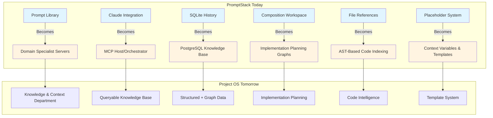

# PromptStack Architecture Scalability Review

**Date:** 2026-01-07  
**Reviewer:** Architect Mode  
**Purpose:** Evaluate scalability of initial PromptStack architecture to support Project OS vision

---

## Executive Summary

**Overall Assessment:** ✅ **Highly Scalable with Strategic Enhancements**

The current PromptStack architecture demonstrates excellent foundational design principles that naturally support evolution toward Project OS. The domain-driven structure, interface-first approach, and clear separation of concerns provide a solid foundation. However, several strategic enhancements are needed to fully realize the Project OS vision.

**Key Strengths:**
- Domain-driven design with 8 well-defined domains
- Interface-first design enabling dependency inversion
- Clear dependency boundaries (UI → Domains → Platform)
- Repository pattern already planned for data layer
- Strategy pattern for context selection
- Plugin architecture foundation

**Critical Gaps:**
- No abstraction layer for AI providers (currently direct Claude integration)
- Storage layer tightly coupled to SQLite
- Library source not abstracted (filesystem-only)
- Missing domain events system for decoupling
- No middleware pattern for cross-cutting concerns
- Configuration structure not extensible for future providers

**Recommendation:** Implement Phase 1 abstractions immediately (interfaces for AI, storage, library sources) to enable smooth evolution without major refactoring later.

---

## Current State Analysis

### What PromptStack Is Today

Based on [`what-we-are-building.md`](what-we-are-building.md):

**Core Capabilities:**
- CLI tool for AI prompt composition
- Prompt library with 4 categories (workflows, commands, decorations, rules)
- Claude API integration for suggestions
- SQLite-based history with FTS5 search
- TUI with Bubble Tea framework
- Vim keybindings support
- Auto-save with undo/redo (100 levels)
- Placeholder system (text/list)
- File reference system with fuzzy finder

**Architecture:**
- 8 core domains with clear responsibilities
- Domain-driven design principles
- Test-driven development (80%+ coverage target)
- 38 granular milestones
- macOS-only initially

**Technology Stack:**
- Go + Bubble Tea (TUI)
- SQLite (history)
- Claude API (AI)
- Filesystem (library storage)

### What Project OS Wants to Be

Based on [`future-extensibility.md`](../idea/future-extensibility.md):

**Vision:**
- Knowledge & Context Department for organizations
- Queryable knowledge base of business and code
- MCP-based specialist servers (Tax, Security, Compliance, etc.)
- PostgreSQL + Neo4j for structured and graph data
- Implementation planning graphs
- Complete SDLC integration

**Key Evolution Points:**
```
PromptStack Today → Project OS Tomorrow
├── Prompt Library → Domain Specialist Servers
├── Claude Integration → MCP Host/Orchestrator
├── SQLite History → PostgreSQL Knowledge Base
├── Composition Workspace → Implementation Planning Graphs
├── File References → AST-Based Code Indexing
└── Placeholder System → Context Variables & Templates
```

---

## Scalability Assessment by Domain

### 1. AI Domain

**Current Implementation:**
- Direct Claude API integration in [`internal/ai/client.go`](project-structure.md:123)
- Context selection algorithm hardcoded
- Token estimation and budgeting
- Suggestion parsing and diff generation

**Future Requirements:**
- MCP-based specialist servers
- Multiple AI providers (Claude, OpenAI, etc.)
- Specialist routing based on query type
- Context-aware specialist selection

**Scalability Rating:** ⚠️ **Moderate - Needs Abstraction**

**Issues:**
1. **No AI Provider Interface** - Direct Claude coupling prevents easy provider swapping
2. **Hardcoded Context Selection** - Algorithm not pluggable for specialist routing
3. **No Middleware Support** - Cannot add logging, caching, metrics without modifying core

**Required Enhancements:**
```go
// Add: internal/ai/provider.go
type AIProvider interface {
    GetSuggestions(ctx context.Context, prompt string) ([]Suggestion, error)
    ApplyChanges(ctx context.Context, changes []Change) (string, error)
    EstimateTokens(ctx context.Context, text string) (int, error)
}

// Add: internal/ai/selector.go
type ContextSelector interface {
    Select(ctx context.Context, composition string, library []Prompt) ([]Prompt, error)
    Name() string
}

// Add: internal/ai/middleware.go
type ProviderMiddleware func(AIProvider) AIProvider
```

**Migration Path:**
1. Extract Claude implementation to `internal/ai/claude.go`
2. Create `AIProvider` interface in `internal/ai/provider.go`
3. Create `ContextSelector` interface in `internal/ai/selector.go`
4. Add factory pattern for provider instantiation
5. Implement middleware support for logging, caching, metrics

**Effort:** Medium (2-3 days)

---

### 2. Storage Domain (History)

**Current Implementation:**
- SQLite database with FTS5 full-text search
- Markdown file storage as source of truth
- Sync verification between DB and files
- Located in [`internal/history/`](project-structure.md:108)

**Future Requirements:**
- PostgreSQL for structured data
- Neo4j for graph relationships
- Vector embeddings for semantic search
- Multi-database support (SQLite for local, PostgreSQL for team)

**Scalability Rating:** ⚠️ **Moderate - Needs Repository Pattern**

**Issues:**
1. **No Repository Interface** - Direct SQLite operations in business logic
2. **Tight Coupling** - History domain directly uses SQLite
3. **No Abstraction for Search** - FTS5-specific queries embedded in code
4. **No Migration Strategy** - No clear path to PostgreSQL/Neo4j

**Required Enhancements:**
```go
// Add: internal/storage/repository.go
type CompositionRepository interface {
    Save(ctx context.Context, comp Composition) error
    Load(ctx context.Context, id string) (Composition, error)
    Search(ctx context.Context, query string) ([]Composition, error)
    Delete(ctx context.Context, id string) error
    List(ctx context.Context, opts ListOptions) ([]Composition, error)
}

// Add: internal/storage/sqlite.go (current implementation)
// Add: internal/storage/postgres.go (future)
// Add: internal/storage/graph.go (future for Neo4j)

// Add: internal/storage/factory.go
func NewRepository(cfg *config.Config) (CompositionRepository, error)
```

**Migration Path:**
1. Create `CompositionRepository` interface
2. Refactor SQLite operations to implement interface
3. Add factory pattern for repository instantiation
4. Implement PostgreSQL adapter when needed
5. Implement Neo4j adapter for graph queries when needed

**Effort:** Medium (3-4 days)

---

### 3. Library Domain

**Current Implementation:**
- Filesystem-based prompt storage
- YAML frontmatter parsing
- In-memory indexing
- Fuzzy search
- Located in [`internal/library/`](project-structure.md:96)

**Future Requirements:**
- Specialist server-based prompts
- Remote prompt repositories
- Version-controlled prompts
- Dynamic prompt loading from MCP servers

**Scalability Rating:** ⚠️ **Moderate - Needs Source Abstraction**

**Issues:**
1. **No Source Interface** - Library tightly coupled to filesystem
2. **No Remote Loading** - Cannot load prompts from MCP servers
3. **No Versioning** - No support for prompt versioning
4. **No Caching Strategy** - Remote prompts would require caching

**Required Enhancements:**
```go
// Add: internal/library/source.go
type PromptSource interface {
    Load(ctx context.Context) ([]Prompt, error)
    Get(ctx context.Context, id string) (Prompt, error)
    Watch(ctx context.Context) (<-chan PromptEvent, error)
}

// Add: internal/library/filesystem.go (current implementation)
// Add: internal/library/specialist.go (future for MCP servers)
// Add: internal/library/remote.go (future for remote repos)

// Add: internal/library/cache.go
type PromptCache interface {
    Get(id string) (Prompt, bool)
    Set(id string, prompt Prompt)
    Invalidate(id string)
}
```

**Migration Path:**
1. Create `PromptSource` interface
2. Refactor filesystem loader to implement interface
3. Add caching layer for remote sources
4. Implement specialist server source when needed
5. Add versioning support to prompt model

**Effort:** Medium (2-3 days)

---

### 4. Editor Domain

**Current Implementation:**
- Text buffer with cursor management
- Undo/redo stack (100 levels)
- Placeholder parsing and editing
- Located in [`internal/editor/`](project-structure.md:76)

**Future Requirements:**
- AST-based code editing
- Multi-file editing
- Collaborative editing
- Rich text formatting

**Scalability Rating:** ✅ **High - Well-Designed**

**Strengths:**
1. **Clean Separation** - Editor domain independent of prompts/AI
2. **Undo/Redo Pattern** - Extensible for collaborative editing
3. **Placeholder System** - Can evolve to template variables
4. **No External Dependencies** - Pure text editing logic

**Minor Enhancements:**
- Consider adding `Document` interface for multi-file support
- Add `Change` interface for collaborative editing
- Extend placeholder system for nested templates

**Effort:** Low (1-2 days for minor enhancements)

---

### 5. Prompt Domain

**Current Implementation:**
- Prompt model with YAML frontmatter
- Placeholder parsing and validation
- Metadata management
- Located in [`internal/prompt/`](project-structure.md:84)

**Future Requirements:**
- Versioned prompts
- Prompt templates with inheritance
- Dynamic prompt generation
- Prompt composition graphs

**Scalability Rating:** ✅ **High - Well-Designed**

**Strengths:**
1. **Clear Model** - Prompt struct well-defined
2. **Placeholder System** - Extensible for templates
3. **Metadata Support** - Can add versioning fields
4. **Validation** - Robust validation system

**Minor Enhancements:**
- Add version field to metadata
- Add parent/child relationships for inheritance
- Extend placeholder system for nested templates

**Effort:** Low (1 day)

---

### 6. Config Domain

**Current Implementation:**
- YAML-based configuration
- First-run setup wizard
- Settings management
- Located in [`internal/config/`](project-structure.md:134)

**Future Requirements:**
- Multiple AI provider configurations
- Specialist server configurations
- Database connection strings
- Plugin configurations

**Scalability Rating:** ⚠️ **Moderate - Needs Extension**

**Issues:**
1. **Limited Fields** - Only Claude API key, model, vim mode
2. **No Provider Selection** - Cannot switch between AI providers
3. **No Storage Configuration** - Cannot configure PostgreSQL/Neo4j
4. **No Plugin Configuration** - No support for plugin settings

**Required Enhancements:**
```go
// Extend: internal/config/config.go
type Config struct {
    // Current fields
    ClaudeAPIKey string `yaml:"claude_api_key"`
    Model        string `yaml:"model"`
    VimMode      bool   `yaml:"vim_mode"`
    DataDir      string `yaml:"data_dir"`
    
    // Future fields (add when needed)
    AIProvider   string   `yaml:"ai_provider"`   // "claude" | "mcp" | "openai"
    Storage      string   `yaml:"storage"`       // "sqlite" | "postgres" | "graph"
    Specialists  []string `yaml:"specialists"`   // Enabled specialists
    MCPHost      string   `yaml:"mcp_host"`      // MCP orchestrator address
    PostgresURL  string   `yaml:"postgres_url"`   // PostgreSQL connection string
    Neo4jURL     string   `yaml:"neo4j_url"`     // Neo4j connection string
    EnablePlugins bool     `yaml:"enable_plugins"` // Enable external plugins
    PluginDir    string   `yaml:"plugin_dir"`    // Directory for plugins
}
```

**Migration Path:**
1. Add new fields to `Config` struct
2. Update setup wizard for new fields
3. Add validation for new configurations
4. Implement factory patterns using new config fields

**Effort:** Low (1 day)

---

### 7. UI Domain

**Current Implementation:**
- Bubble Tea TUI framework
- Multiple screen models (workspace, browser, history, etc.)
- Modal overlays
- Theme system with Catppuccin Mocha
- Located in [`ui/`](project-structure.md:173)

**Future Requirements:**
- Web UI for team collaboration
- Real-time updates
- Rich visualizations (graphs, charts)
- Multi-user interfaces

**Scalability Rating:** ✅ **High - Well-Designed**

**Strengths:**
1. **Clean Separation** - UI independent of business logic
2. **Component-Based** - Reusable UI components
3. **Theme System** - Centralized styling
4. **Message-Based** - Event-driven architecture

**Considerations:**
- Bubble Tea is terminal-only; would need separate web UI for collaboration
- Current architecture supports adding web UI without modifying business logic
- Theme system can be extended for web UI

**Effort:** N/A (separate project for web UI)

---

### 8. Platform Domain

**Current Implementation:**
- Bootstrap orchestration
- Logging with zap
- Error handling
- File system utilities
- Located in [`internal/platform/`](project-structure.md:142)

**Future Requirements:**
- Distributed logging
- Metrics collection
- Tracing
- Event bus

**Scalability Rating:** ✅ **High - Well-Designed**

**Strengths:**
1. **Clear Separation** - Infrastructure separate from business logic
2. **Logging Abstraction** - Can swap zap for distributed logging
3. **Error Handling** - Structured error types
4. **No Business Logic** - Pure infrastructure

**Minor Enhancements:**
- Add metrics interface
- Add tracing interface
- Add event bus for domain events

**Effort:** Low (1-2 days)

---

## Cross-Cutting Concerns

### Domain Events

**Current State:** ❌ **Not Implemented**

**Future Need:** Decoupling for analytics, audit logging, notifications

**Required Implementation:**
```go
// Add: internal/events/events.go
type Event interface {
    Type() string
    Timestamp() time.Time
    Payload() map[string]interface{}
}

type CompositionSavedEvent struct { ... }
type PromptUsedEvent struct { ... }
type SuggestionAcceptedEvent struct { ... }

// Add: internal/events/dispatcher.go
type Dispatcher struct {
    handlers map[string][]EventHandler
}

func (d *Dispatcher) Publish(event Event)
func (d *Dispatcher) Subscribe(eventType string, handler EventHandler)
```

**Effort:** Medium (2-3 days)

---

### Middleware Pattern

**Current State:** ❌ **Not Implemented**

**Future Need:** Logging, caching, metrics for AI providers

**Required Implementation:**
```go
// Add: internal/ai/middleware.go
type ProviderMiddleware func(AIProvider) AIProvider

func WithLogging(logger *zap.Logger) ProviderMiddleware
func WithCaching(cache Cache) ProviderMiddleware
func WithMetrics(metrics Metrics) ProviderMiddleware
```

**Effort:** Low (1 day)

---

### Plugin Architecture

**Current State:** ❌ **Not Implemented**

**Future Need:** Third-party specialist servers

**Required Implementation:**
```go
// Add: internal/specialist/interface.go
type Specialist interface {
    Name() string
    Category() string
    Description() string
    Query(ctx context.Context, request QueryRequest) (*QueryResponse, error)
    Capabilities() []Capability
}

// Add: internal/specialist/registry.go
type Registry struct {
    specialists map[string]Specialist
}

// Add: internal/specialist/plugin.go
func LoadPlugin(path string) (Specialist, error)
```

**Effort:** Medium (3-4 days)

---

## Dependency Analysis

### Current Dependency Flow

```
ui/           →  internal/{domain}  →  internal/platform
(presentation)   (business logic)      (infrastructure)
```

**Assessment:** ✅ **Excellent**

- Clear dependency direction
- No circular dependencies
- UI depends on domains, not vice versa
- Domains depend on platform, not vice versa

### Future Dependency Flow (Project OS)

```
web-ui/       →  internal/{domain}  →  internal/platform
tui-ui/       →  internal/{domain}  →  internal/platform
mcp-host/     →  internal/{domain}  →  internal/platform
```

**Assessment:** ✅ **Excellent**

- Current architecture supports multiple UIs
- Business logic remains unchanged
- Platform layer can be extended for distributed systems

---

## Scalability Matrix

| Domain | Current Scalability | Required Enhancements | Effort | Priority |
|--------|-------------------|----------------------|--------|----------|
| AI | ⚠️ Moderate | Provider interface, selector interface, middleware | Medium | **High** |
| Storage | ⚠️ Moderate | Repository pattern, factory | Medium | **High** |
| Library | ⚠️ Moderate | Source interface, caching | Medium | **Medium** |
| Editor | ✅ High | Minor enhancements | Low | Low |
| Prompt | ✅ High | Minor enhancements | Low | Low |
| Config | ⚠️ Moderate | Extend fields | Low | **High** |
| UI | ✅ High | N/A (separate web UI) | N/A | Low |
| Platform | ✅ High | Metrics, tracing, event bus | Low | Medium |
| Domain Events | ❌ None | Full implementation | Medium | **High** |
| Middleware | ❌ None | AI middleware | Low | Medium |
| Plugins | ❌ None | Plugin architecture | Medium | Medium |

---

## Recommended Implementation Phases

### Phase 1: Critical Abstractions (Immediate)

**Goal:** Add abstraction layers to enable future evolution without major refactoring.

**Deliverables:**
1. AI Provider interface
2. Context Selector interface
3. Composition Repository interface
4. Prompt Source interface
5. Domain Events system
6. Extended Config structure

**Effort:** 5-7 days

**Priority:** **Critical** - Must be done before MVP completion

---

### Phase 2: Middleware & Caching (Post-MVP)

**Goal:** Add cross-cutting concerns for performance and observability.

**Deliverables:**
1. AI Provider middleware (logging, caching, metrics)
2. Prompt caching layer
3. Metrics collection
4. Distributed logging

**Effort:** 3-4 days

**Priority:** **High** - Needed for production readiness

---

### Phase 3: Plugin Architecture (When Needed)

**Goal:** Enable third-party specialist servers.

**Deliverables:**
1. Specialist interface
2. Plugin registry
3. Plugin loading system
4. Built-in specialists (workflow, code, compliance)

**Effort:** 4-5 days

**Priority:** **Medium** - Needed for Project OS

---

### Phase 4: Multi-Database Support (When Needed)

**Goal:** Support PostgreSQL and Neo4j.

**Deliverables:**
1. PostgreSQL repository implementation
2. Neo4j repository implementation
3. Migration tools
4. Data synchronization

**Effort:** 5-7 days

**Priority:** **Medium** - Needed for Project OS

---

### Phase 5: MCP Integration (When Needed)

**Goal:** Integrate with MCP-based specialist servers.

**Deliverables:**
1. MCP client implementation
2. MCP orchestrator
3. Specialist routing
4. Context-aware selection

**Effort:** 7-10 days

**Priority:** **Medium** - Needed for Project OS

---

## Risk Assessment

### High-Risk Areas

1. **AI Domain Tight Coupling**
   - **Risk:** Direct Claude integration prevents easy provider switching
   - **Impact:** High - Blocks MCP integration
   - **Mitigation:** Implement AI Provider interface immediately

2. **Storage Layer Tight Coupling**
   - **Risk:** Direct SQLite operations in business logic
   - **Impact:** High - Blocks PostgreSQL/Neo4j migration
   - **Mitigation:** Implement Repository pattern immediately

3. **Missing Domain Events**
   - **Risk:** Tight coupling between components
   - **Impact:** Medium - Blocks analytics, audit logging
   - **Mitigation:** Implement domain events system

### Medium-Risk Areas

1. **Library Source Coupling**
   - **Risk:** Filesystem-only prompt loading
   - **Impact:** Medium - Blocks MCP specialist servers
   - **Mitigation:** Implement Prompt Source interface

2. **Configuration Limitations**
   - **Risk:** Cannot configure future providers
   - **Impact:** Medium - Blocks provider switching
   - **Mitigation:** Extend Config structure

### Low-Risk Areas

1. **UI Terminal-Only**
   - **Risk:** Bubble Tea is terminal-only
   - **Impact:** Low - Can add separate web UI
   - **Mitigation:** Keep business logic UI-agnostic

2. **Editor Domain Limitations**
   - **Risk:** Single-file editing only
   - **Impact:** Low - Can extend for multi-file support
   - **Mitigation:** Add Document interface when needed

---

## Recommendations

### Immediate Actions (Before MVP)

1. **Implement AI Provider Interface**
   - Extract Claude implementation to `internal/ai/claude.go`
   - Create `AIProvider` interface in `internal/ai/provider.go`
   - Add factory pattern for provider instantiation
   - **Timeline:** 2-3 days

2. **Implement Repository Pattern**
   - Create `CompositionRepository` interface in `internal/storage/repository.go`
   - Refactor SQLite operations to implement interface
   - Add factory pattern for repository instantiation
   - **Timeline:** 2-3 days

3. **Implement Domain Events**
   - Create event types in `internal/events/events.go`
   - Create dispatcher in `internal/events/dispatcher.go`
   - Integrate with composition save, prompt use, suggestion accept
   - **Timeline:** 2-3 days

4. **Extend Config Structure**
   - Add future fields to `Config` struct
   - Update setup wizard for new fields
   - Add validation for new configurations
   - **Timeline:** 1 day

### Post-MVP Actions

1. **Implement Middleware Pattern**
   - Add AI Provider middleware support
   - Implement logging middleware
   - Implement caching middleware
   - **Timeline:** 1-2 days

2. **Implement Prompt Source Interface**
   - Create `PromptSource` interface in `internal/library/source.go`
   - Refactor filesystem loader to implement interface
   - Add caching layer for remote sources
   - **Timeline:** 2-3 days

3. **Add Metrics Collection**
   - Create metrics interface in `internal/platform/metrics/`
   - Implement metrics collection for AI operations
   - Add metrics to status bar or log viewer
   - **Timeline:** 1-2 days

### When Needed for Project OS

1. **Implement Plugin Architecture**
   - Create specialist interface
   - Implement plugin registry
   - Add plugin loading system
   - **Timeline:** 4-5 days

2. **Implement PostgreSQL Support**
   - Create PostgreSQL repository implementation
   - Add migration tools
   - Implement data synchronization
   - **Timeline:** 3-4 days

3. **Implement Neo4j Support**
   - Create Neo4j repository implementation
   - Add graph query support
   - Implement relationship tracking
   - **Timeline:** 3-4 days

4. **Implement MCP Integration**
   - Create MCP client implementation
   - Implement MCP orchestrator
   - Add specialist routing
   - **Timeline:** 7-10 days

---

## Conclusion

The PromptStack architecture demonstrates excellent foundational design principles that naturally support evolution toward Project OS. The domain-driven structure, interface-first approach, and clear separation of concerns provide a solid foundation.

**Key Takeaways:**

1. **Strong Foundation:** The 8-domain architecture is well-designed and scalable
2. **Critical Gaps:** AI provider, storage, and library source need abstraction layers
3. **Low Risk:** Most domains are well-designed and require minimal changes
4. **Clear Path:** Phased implementation approach enables incremental evolution

**Overall Verdict:** ✅ **Highly Scalable with Strategic Enhancements**

The architecture is well-positioned to evolve into Project OS with the recommended Phase 1 abstractions implemented immediately. The incremental approach allows for smooth evolution without major refactoring later.

---

## Appendix: Architecture Evolution Diagram



---

**Last Updated:** 2026-01-07  
**Status:** Ready for Review  
**Next Steps:** Implement Phase 1 Critical Abstractions