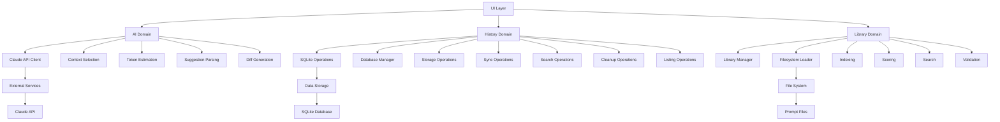

```mermaid
graph TD
    A[UI Layer] --> B[AI Domain]
    A --> C[Storage Domain]
    A --> D[Library Domain]
    A --> E[Events Domain]
    
    B --> B1[AIProvider Interface]
    B1 --> B2[Claude Provider]
    B1 --> B3[MCP Provider - Future]
    B1 --> B4[OpenAI Provider - Future]
    
    B --> B5[ContextSelector Interface]
    B5 --> B6[Default Selector]
    
    B --> B7[ProviderMiddleware]
    B7 --> B8[Logging Middleware]
    B7 --> B9[Caching Middleware]
    B7 --> B10[Metrics Middleware]
    
    B --> B11[Token Estimation]
    B --> B12[Suggestion Parsing]
    B --> B13[Diff Generation]
    
    C --> C1[CompositionRepository Interface]
    C1 --> C2[SQLite Repository]
    C1 --> C3[PostgreSQL Repository - Future]
    C1 --> C4[Neo4j Repository - Future]
    
    C --> C5[Repository Factory]
    C5 --> C1
    
    C --> C6[History Manager]
    C6 --> C1
    C6 --> C7[Sync Operations]
    C6 --> C8[Search Operations]
    C6 --> C9[Cleanup Operations]
    C6 --> C10[Listing Operations]
    
    D --> D11[PromptSource Interface]
    D11 --> D12[Filesystem Source]
    D11 --> D13[MCP Specialist Source - Future]
    D11 --> D14[Remote Repository Source - Future]
    
    D --> D15[PromptCache Interface]
    D15 --> D16[Memory Cache]
    
    D --> D17[Library Manager]
    D17 --> D11
    D17 --> D18[Indexing]
    D17 --> D19[Scoring]
    D17 --> D20[Search]
    D17 --> D21[Validation]
    
    E --> E22[Event Interface]
    E22 --> E23[BaseEvent]
    E22 --> E24[CompositionSavedEvent]
    E22 --> E25[PromptUsedEvent]
    E22 --> E26[SuggestionAcceptedEvent]
    
    E --> E27[Event Dispatcher]
    E27 --> E28[Subscribe/Publish Pattern]
    
    B2 --> F[External Services]
    F --> F1[Claude API]
    
    C2 --> G[Data Storage]
    G --> G1[SQLite Database]
    G --> G2[PostgreSQL Database - Future]
    G --> G3[Neo4j Database - Future]
    
    D12 --> H[File System]
    H --> H1[Prompt Files]
    
    E27 -.-> I[Event Handlers]
    I --> I1[Analytics]
    I --> I2[Audit Logging]
    I --> I3[Notifications]
    I --> I4[Cache Invalidation]
```

```mermaid
graph TD
    A[UI Layer] --> B[AI Domain]
    A --> C[Storage Domain]
    A --> D[Library Domain]
    A --> E[Events Domain]
    A --> F[Specialist Domain]
    
    B --> B1[AIProvider Interface]
    B1 --> B2[Claude Provider]
    B1 --> B3[MCP Provider]
    B1 --> B4[OpenAI Provider]
    B1 --> B5[Custom Providers]
    
    B --> B6[ContextSelector Interface]
    B6 --> B7[Default Selector]
    B6 --> B8[Custom Selectors]
    
    B --> B9[ProviderMiddleware]
    B9 --> B10[Logging Middleware]
    B9 --> B11[Caching Middleware]
    B9 --> B12[Metrics Middleware]
    B9 --> B13[Custom Middleware]
    
    C --> C1[CompositionRepository Interface]
    C1 --> C2[SQLite Repository]
    C1 --> C3[PostgreSQL Repository]
    C1 --> C4[Neo4j Repository]
    C1 --> C5[Custom Repositories]
    
    C --> C6[Repository Factory]
    C6 --> C1
    
    D --> D7[PromptSource Interface]
    D7 --> D8[Filesystem Source]
    D7 --> D9[MCP Specialist Source]
    D7 --> D10[Remote Repository Source]
    D7 --> D11[Custom Sources]
    
    D --> D12[PromptCache Interface]
    D12 --> D13[Memory Cache]
    D12 --> D14[Redis Cache]
    D12 --> D15[Custom Caches]
    
    E --> E16[Event Interface]
    E16 --> E17[BaseEvent]
    E16 --> E18[Custom Events]
    
    E --> E19[Event Dispatcher]
    E19 --> E20[Subscribe/Publish Pattern]
    
    F --> F21[Specialist Interface]
    F21 --> F22[Code Review Specialist]
    F21 --> F23[Documentation Specialist]
    F21 --> F24[Testing Specialist]
    F21 --> F25[Custom Specialists]
    
    F --> F26[Specialist Registry]
    F26 --> F21
    
    F --> F27[Plugin Management]
    F27 --> F28[Plugin Discovery]
    F27 --> F29[Plugin Loading]
    F27 --> F30[Plugin Lifecycle]
    
    B2 --> G[External Services]
    G --> G1[Claude API]
    G --> G2[MCP Orchestrator]
    G --> G3[OpenAI API]
    
    C2 --> H[Data Storage]
    H --> H1[SQLite Database]
    H --> H2[PostgreSQL Database]
    H --> H3[Neo4j Database]
    H --> H4[Custom Storage]
    
    D8 --> I[File System]
    I --> I1[Prompt Files]
    I --> I2[Remote Repositories]
    
    D9 --> J[MCP Specialists]
    J --> J1[Code Review Server]
    J --> J2[Documentation Server]
    J --> J3[Custom Specialist Servers]
    
    E19 -.-> K[Event Handlers]
    K --> K1[Analytics]
    K --> K2[Audit Logging]
    K --> K3[Notifications]
    K --> K4[Cache Invalidation]
    K --> K5[Custom Handlers]
    
    F27 -.-> L[Plugins]
    L --> L1[Third-party Specialists]
    L --> L2[Custom Plugins]
```

# Architecture Evolution

**Purpose**: Visual representation of architecture evolution from current state through updated state to future Project OS

**Date**: 2026-01-07  
**Status**: Planning Phase - Pre-Implementation

---

## Overview

This document provides visual architecture diagrams showing the evolution of PromptStack's architecture through three phases:
1. **Current Architecture** (Before Updates)
2. **Updated Architecture** (After Phase 1 Updates)
3. **Future Architecture** (Project OS)

---

## Current Architecture (Before Updates)

### Package Structure

```
internal/
├── ai/              # Direct Claude integration
│   ├── client.go              # Claude API client
│   ├── context.go             # Context selection
│   ├── tokens.go              # Token estimation
│   ├── suggestions.go         # Suggestion parsing
│   └── diff.go                # Diff generation
├── history/          # Direct SQLite operations
│   ├── manager.go
│   ├── database.go
│   ├── storage.go
│   ├── sync.go
│   ├── search.go
│   ├── cleanup.go
│   └── listing.go
├── library/          # Direct filesystem access
│   ├── library.go
│   ├── loader.go
│   ├── index.go
│   ├── scorer.go
│   ├── search.go
│   └── validator.go
└── config/           # Basic config
    └── config.go
```

### Architecture Diagram



### Key Characteristics

- **Direct Integration**: No abstraction layers
- **Tight Coupling**: Components directly depend on implementations
- **Limited Extensibility**: Hard to add new providers, sources, or backends
- **Single Provider**: Only Claude API supported
- **Single Storage**: Only SQLite supported
- **Single Source**: Only filesystem supported

---

## Updated Architecture (After Phase 1 Updates)

### Package Structure

```
internal/
├── ai/              # Provider abstraction
│   ├── provider.go            # AIProvider interface
│   ├── claude.go              # Claude implementation
│   ├── selector.go            # ContextSelector interface
│   ├── context.go             # REFACTOR: Implement ContextSelector
│   ├── middleware.go          # ProviderMiddleware type
│   ├── tokens.go              # Unchanged
│   ├── suggestions.go         # Unchanged
│   └── diff.go                # Unchanged
├── storage/          # Repository abstraction (NEW)
│   ├── repository.go          # CompositionRepository interface
│   ├── sqlite.go              # SQLite implementation
│   ├── factory.go             # Repository factory
│   ├── postgres.go            # FUTURE: PostgreSQL implementation
│   └── graph.go               # FUTURE: Neo4j implementation
├── history/          # REFACTOR: Use repository pattern
│   ├── manager.go             # REFACTOR: Use repository
│   ├── database.go            # DEPRECATE: Move to storage/sqlite.go
│   ├── storage.go            # DEPRECATE: Move to storage/sqlite.go
│   ├── sync.go               # REFACTOR: Use repository
│   ├── search.go             # REFACTOR: Use repository
│   ├── cleanup.go            # REFACTOR: Use repository
│   └── listing.go            # REFACTOR: Use repository
├── library/          # Source abstraction
│   ├── source.go             # PromptSource interface
│   ├── filesystem.go         # Filesystem implementation
│   ├── cache.go             # Prompt cache
│   ├── library.go            # REFACTOR: Use PromptSource
│   ├── loader.go             # DEPRECATE: Move to filesystem.go
│   ├── index.go              # Unchanged
│   ├── scorer.go             # Unchanged
│   ├── search.go             # Unchanged
│   ├── validator.go          # Unchanged
│   ├── specialist.go         # FUTURE: MCP specialist source
│   └── remote.go            # FUTURE: Remote repository source
├── events/           # Domain events (NEW)
│   ├── events.go             # Event types
│   └── dispatcher.go         # Event dispatcher
└── config/           # Extended config
    └── config.go             # Updated with new fields
```

### Architecture Diagram



### Key Characteristics

- **Interface-Based**: All domains use interfaces for abstraction
- **Loose Coupling**: Components depend on interfaces, not implementations
- **High Extensibility**: Easy to add new providers, sources, or backends
- **Multiple Providers**: Claude (current), MCP (future), OpenAI (future)
- **Multiple Storage**: SQLite (current), PostgreSQL (future), Neo4j (future)
- **Multiple Sources**: Filesystem (current), MCP specialists (future), remote repos (future)
- **Domain Events**: Decoupled components via pub/sub pattern
- **Middleware Support**: Cross-cutting concerns via middleware pattern
- **Factory Pattern**: Configuration-driven instantiation

---

## Future Architecture (Project OS)

### Package Structure

```
internal/
├── ai/              # Multiple providers
│   ├── provider.go
│   ├── claude.go
│   ├── mcp.go                # MCP provider
│   ├── openai.go             # OpenAI provider
│   ├── selector.go
│   ├── middleware.go
│   └── tokens.go
├── storage/          # Multiple backends
│   ├── repository.go
│   ├── sqlite.go
│   ├── postgres.go            # PostgreSQL
│   ├── graph.go               # Neo4j
│   └── factory.go
├── library/          # Multiple sources
│   ├── source.go
│   ├── filesystem.go
│   ├── specialist.go          # MCP specialists
│   ├── remote.go             # Remote repos
│   └── cache.go
├── events/           # Domain events
│   ├── events.go
│   └── dispatcher.go
├── specialist/       # Plugin system (NEW)
│   ├── interface.go           # Specialist interface
│   ├── registry.go           # Specialist registry
│   └── plugin.go             # Plugin management
└── config/           # Full config
    └── config.go
```

### Architecture Diagram



### Key Characteristics

- **Fully Extensible**: All domains support custom implementations
- **Plugin System**: Third-party specialists via plugin architecture
- **Multiple Providers**: Claude, MCP, OpenAI, and custom providers
- **Multiple Storage**: SQLite, PostgreSQL, Neo4j, and custom backends
- **Multiple Sources**: Filesystem, MCP specialists, remote repos, and custom sources
- **Advanced Caching**: Memory, Redis, and custom caches
- **Rich Event System**: Custom events and handlers
- **Specialist Registry**: Dynamic discovery and loading of specialists
- **Plugin Management**: Full plugin lifecycle support

---

## Architecture Comparison

### Evolution Summary

| Aspect | Current | Updated | Future |
|---------|----------|----------|---------|
| **AI Providers** | Claude only | Claude (current), MCP (future), OpenAI (future) | Claude, MCP, OpenAI, Custom |
| **Storage Backends** | SQLite only | SQLite (current), PostgreSQL (future), Neo4j (future) | SQLite, PostgreSQL, Neo4j, Custom |
| **Prompt Sources** | Filesystem only | Filesystem (current), MCP (future), Remote (future) | Filesystem, MCP, Remote, Custom |
| **Abstraction** | None | Interfaces for all domains | Interfaces + Plugin System |
| **Coupling** | Tight | Loose | Very Loose |
| **Extensibility** | Low | High | Very High |
| **Domain Events** | None | Basic | Advanced |
| **Middleware** | None | Basic | Advanced |
| **Caching** | None | Memory cache | Memory, Redis, Custom |
| **Plugins** | None | None | Full plugin system |

### Benefits of Updated Architecture

1. **Separation of Concerns**: Each domain has clear responsibilities
2. **Testability**: Interfaces enable easy mocking for tests
3. **Maintainability**: Changes to implementations don't affect consumers
4. **Extensibility**: New providers, sources, and backends can be added easily
5. **Flexibility**: Configuration-driven instantiation
6. **Decoupling**: Domain events enable loose coupling
7. **Reusability**: Middleware and patterns can be reused across domains
8. **Scalability**: Architecture supports growth to Project OS

---

## Migration Path

### Phase 1: Current → Updated

1. **Add Interfaces**: Define interfaces for all domains
2. **Implement Abstractions**: Create concrete implementations
3. **Refactor Existing Code**: Update to use interfaces
4. **Add Factories**: Implement factory patterns
5. **Add Middleware**: Implement middleware pattern
6. **Add Events**: Implement domain events system
7. **Update Configuration**: Add new configuration fields
8. **Update Documentation**: Update all planning documents

### Phase 2: Updated → Future

1. **Add Plugin System**: Implement specialist plugin architecture
2. **Add MCP Integration**: Implement MCP provider and sources
3. **Add OpenAI Provider**: Implement OpenAI provider
4. **Add PostgreSQL Backend**: Implement PostgreSQL repository
5. **Add Neo4j Backend**: Implement Neo4j repository
6. **Add Remote Sources**: Implement remote repository sources
7. **Add Advanced Caching**: Implement Redis cache
8. **Add Custom Events**: Support custom event types
9. **Add Custom Handlers**: Support custom event handlers

---

**Last Updated**: 2026-01-07  
**Status**: Ready for Review  
**Related Documents**: 
- [`scalability-implementation-summary.md`](./scalability-implementation-summary.md)
- [`scalability-project-structure-updates.md`](./scalability-project-structure-updates.md)
- [`scalability-implementation-plan-index.md`](./scalability-implementation-plan-index.md)